# 基础：微信小程序框架


## 简要介绍：与网页程序间的区别

> 了解：微信小程序 和 网页程序 的 3 个主要区别


**运行环境**

- 网页：在浏览器中运行
- 小程序：在微信中运行


**开发环境**

- 网页：代码编辑器 + 网页浏览器
- 小程序：代码编辑器 + 微信模拟器  (微信开发者工具)


**调用的 API**

- 网页：浏览器的 BOM & DOM API
- 小程序：小程序专用 API （网络请求、地理定位、扫码、支付、摄像头、蓝牙、微信登录等）


**本章问题**

- Q1：小程序是在网页浏览器中运行么？
- Q2：开发小程序需要哪些工具？
- Q3：小程序能调用 DOM、BOM API 吗？

---


## 开发环境：注册账号

> 注册一个微信小程序账号


**概念介绍**

小程序账号的作用是：

- 登录小程序管理后台
- 登录小程序开发工具


**操作步骤**

1. 微信公众平台：https://mp.weixin.qq.com


2. 选择账号类型：小程序

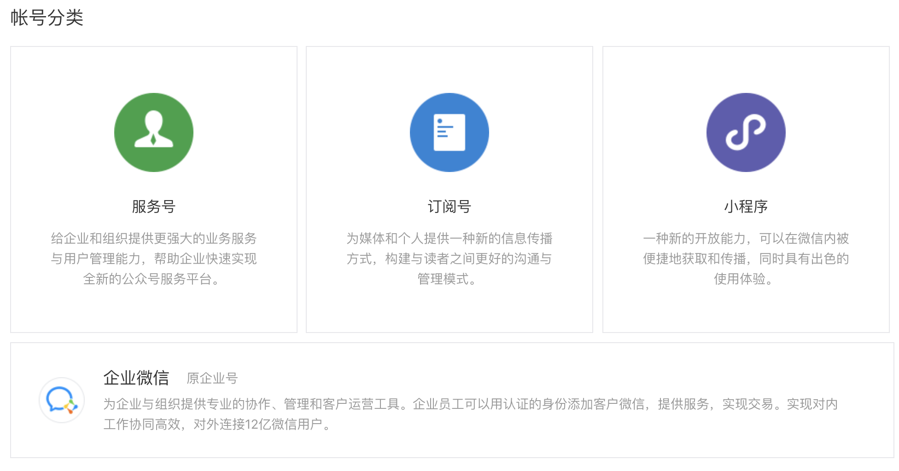


3. 填写账号信息：邮箱、密码


4. 点击邮件中的激活链接


5. 登记用户详细信息

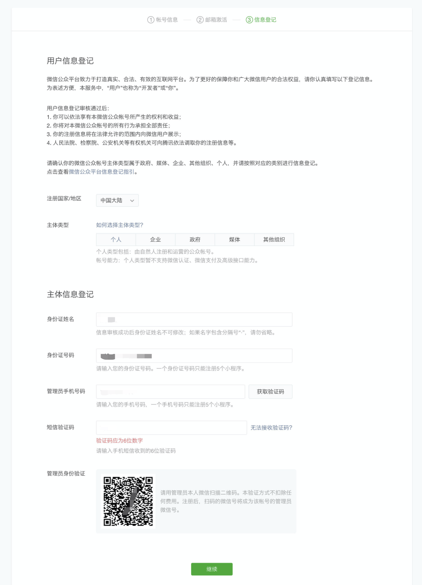


**本章问题**

- Q1：小程序账号有哪些作用？

---


## 开发环境： 添加成员

> 让多人共用同一个小程序账号，进行协作开发


**概念介绍**

企业中，一个小程序通常由多人开发、发布、运营。因此，会有多个人员需要使用同一个账号。

管理员只要在小程序管理后台页面中，添加共享人员的微信号和权限，就能让他们扫码登录。


**操作步骤**

1. 登录微信小程序的管理后台页面


2. 进入 “成员管理” 


3. 将同事的微信号，添加为本账号的 “项目成员”

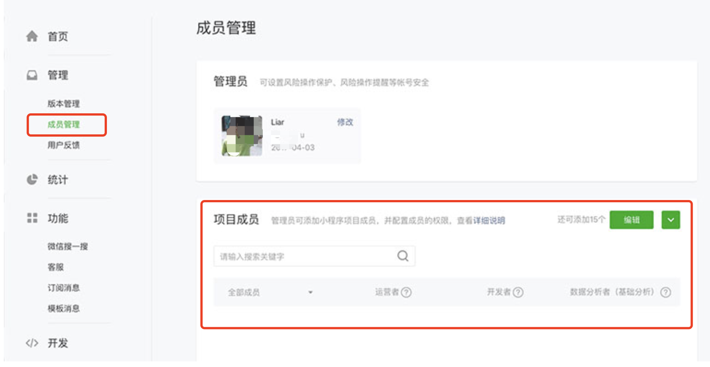


**本章问题**

- Q1：为什么要共享小程序账号？ 
- Q2：在管理页面的哪个菜单下能添加成员？

---


## 开发环境：获取AppID

> 在管理后台中找到小程序账号的 AppID 


**概念介绍**

AppID 是一个小程序的唯一识别码。它的主要作用是：

- 运行小程序代码时，必须要有 AppID
- 从一个小程序跳到另一个小程序时，必须要有目标小程序的 AppID


**操作步骤**

1. 打开小程序管理后台页面，并进入“开发管理” 菜单


2. 在 “开发设置” 栏目下找到 AppID

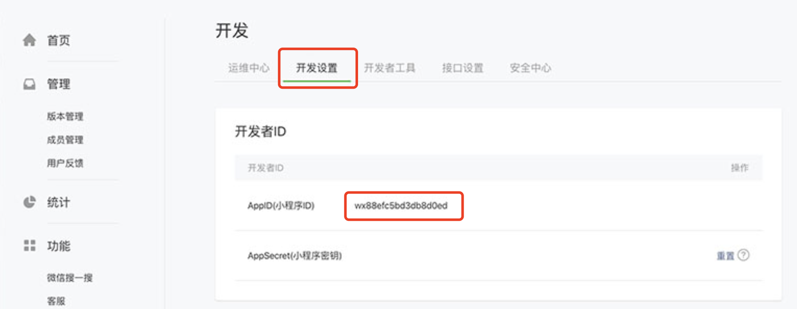


**本章问题**

- Q1：AppID能用来做什么事情？
- Q2：在管理页面的哪个菜单里可以找到AppID？

---


## 开发环境：安装工具

> 下载安装小程序的专用开发工具


**概念介绍**

官方提供了小程序专用的开发工具，叫做**《微信开发者工具》**，它的主要功能包括：

1. 代码骨架生成
2. 代码编辑
3. 代码运行、调试
4. 代码上线发布


**操作步骤**

1. 下载地址：https://developers.weixin.qq.com/miniprogram/dev/devtools/download.html
2. 安装方法：点击安装包，并一路 `下一步` 即可


**本章问题**

- Q1：微信开发者工具主要包含哪些功能？ 

---


## 快速体验：创建小程序

> 使用《微信开发者工具》创建一个小程序项目


**操作步骤**

1. 打开微信开发者工具，并扫码登录


2. 选择左侧菜单中的 “小程序”


3. 填写表单

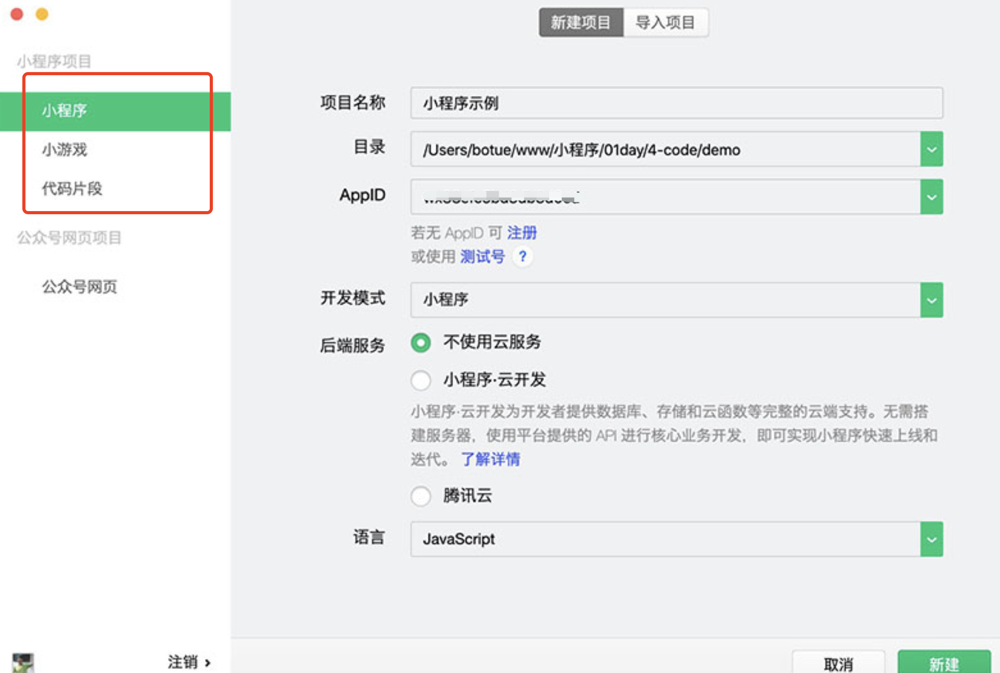


**本章问题**

- Q1：在左侧菜单中选择哪一个类别来创建小程序？

---


## 快速体验：真机运行

> 在真实手机上，查看处于开发阶段的小程序代码的运行效果


**操作步骤**

1. 生成二维码：点击工具栏上的 “预览” 按钮


2. 扫描二维码：必须使用管理员或成员的微信来扫码

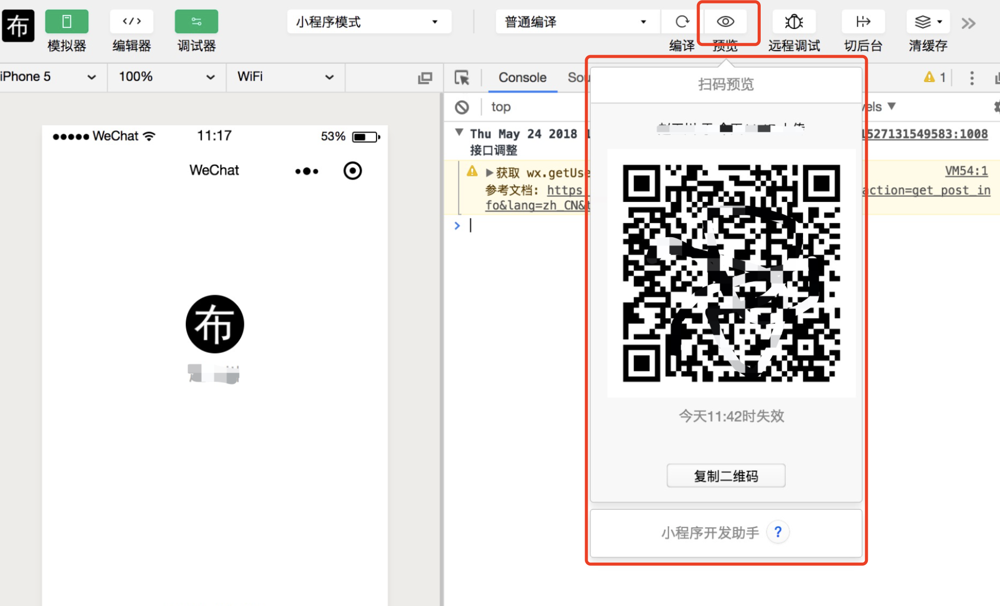


**本章问题**

- Q1：哪些人能扫码真机查看开发中的小程序？

---


## 上线发布：三步上线

> 了解将小程序代码发布到正式环境的流程


**操作步骤**

1. **上传代码**，生成 “开发版本”

```
通过《微信开发者工具》中右上角的 “上传” 按钮来上传代码
```


2. **提交审核**，成为 “审核版本”

```
1. 登录管理者后台，并进入”版本管理”菜单
3. 将 “开发版本” 提交审核
```


3. **发布确认**，成为 “线上版本”

```
审核通过后，需手动点击 “发布” 按钮才能完成上线
```


**本章问题**

- Q1：发布需要经历那几个版本阶段？

---


## 项目结构：项目结构

> 了解项目的目录结构、文件的基本功能


**概念介绍**

默认结构

```diff
.
├── app.js ...................................................... 小程序入口文件
├── app.json .................................................... 小程序全局配置
├── app.wxss .................................................... 小程序全局样式
│
├── pages ....................................................... 所有页面目录
│   ├── index ................................................... index页面目录
│   │   ├── index.js ............................................ index页面业务逻辑
│   │   ├── index.wxml .......................................... index页面布局结构
│   │   └── index.wxss .......................................... index页面布局样式
│   └── logs .................................................... logs页目录
│       ├── logs.js ............................................. logs页面业务逻辑
│       ├── logs.json ........................................... logs页面配置文件
│       ├── logs.wxml ........................................... logs页面布局结构
│       └── logs.wxss ........................................... logs页面布局样式
│
├── utils ....................................................... 公共逻辑
│   └── util.js ................................................. 实用工具
│
├── project.config.json ......................................... 开发工具配置文件
└── sitemap.json ................................................ 搜索引擎优化文件
```


**小程序根目录下的 3 个名为 app.* 的文件：全局文件**

| 文件类型 | 必填 | 描述           |
| -------- | ---- | -------------- |
| app.js   | 是   | 小程序入口     |
| app.json | 是   | 小程序全局配置 |
| app.wxss | 否   | 小程序全局样式 |


**小程序的一个页面，是由 4 个同名文件组成：**

| 文件后缀 | 必填 | 描述         |
| -------- | ---- | ------------ |
| .js      | 是   | 页面逻辑     |
| .wxml    | 是   | 页面布局结构 |
| .wxss    | 否   | 局部布局样式 |
| .json    | 否   | 局部配置     |


**本章问题**

- Q1：小程序的一个页面，由哪几个文件组成？ 
- Q2：小程序的全局文件有哪些？


---


## 视图布局：页面结构语言 WXML

> 了解编写小程序页面结构的语言：WXML


**概念介绍**

WXML 是小程序的标签语言 ，作用和 HTML 一样。常用的标签有（也称为组件）：

- 容器类组件 `<view>`   => div
- 内容类组件 `<text>`  => span
- 媒体类组件 `<image>` => img
- 导航类组件`<navigator>` => a
- 表单类组件 `<input>` 、`<button>`
- 轮播图组件 `<swiper>`


**本章问题**

- Q1：什么是 WXML？ 
- Q2：小程序里使用什么组件来显示图片？

---


## 视图布局：页面样式语言 WXSS

> 了解编写小程序页面样式的语言：WXSS


**概念介绍**

WXSS 是小程序的样式语言 ，它的功能和语法都和 CSS 非常类似。

两者主要区别是：

1. **比 CSS 少了功能**：支持选择器较少

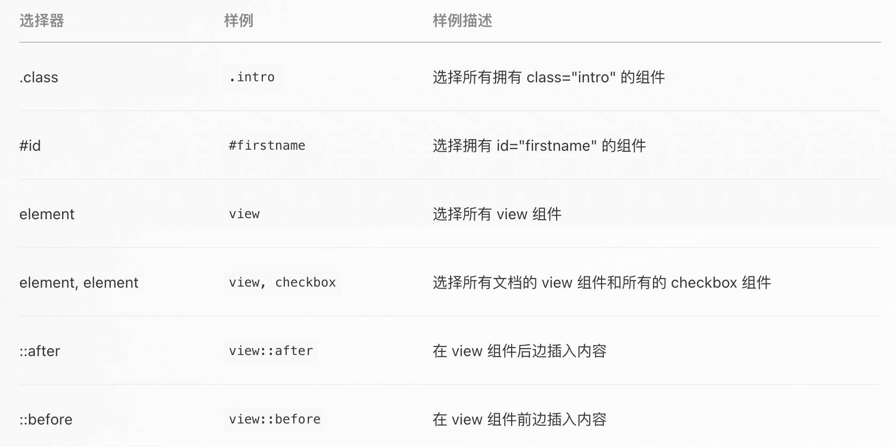


2. **比 CSS 多了功能**：长度单位 rpx


```bash
# 示例演示：使用 WXSS 为之前的轮播图示例添加样式。
```


**本章问题**

- Q1：WXSS 与 CSS 的最主要区别有哪些？

---


## 视图布局：屏幕适配

> 通过使用 rpx，让小程序界面能在不同屏幕上同比例缩放


**概念介绍**

rpx 是一个相对长度单位，会根据当前屏幕尺寸，自动调节实际大小。

> 一句话记住 rpx：**“所有屏幕的宽度都是 750rpx“**


**操作步骤**

> 目标：演示 %、rpx、px 三个单位的对比效果

1. 在界面上放置3个view

```xml
<view class="box1">使用百分比</view>
<view class="box2">使用rpx</view>
<view class="box3">使用px</view>
```


2. 设置第一个view的宽度为`50%`

```css
/* 使用百分比设置屏幕的一半宽度：50% */
.box1 {
  width: 50%;
  background-color: #cccccc;
}

/* 使用rpx设置屏幕的一半宽度：375rpx */
.box2 {
  width: 375rpx;
  background-color: blue;
}

/* 对照px宽度：375px */
.box3 {
  width: 375px;
  background-color: red;
}
```


3. 在模拟器中选择不同设备机型，观察3个view的长度变化


```bash
# 补充案例：使用 rpx 修正轮播图案例的尺寸，使它在任何设备下看起来都一致。
```


**本章问题**

- Q1：用一句话描述 rpx？ 
- Q2：如果设计稿宽度是375px，那设计稿上标的1px用rpx来表示是多少？

```
1. 将750除以设计稿的宽度，以此算出倍率。（750/375 = 2）
2. 将设计稿上的尺寸除以倍率。（1 * 2 = 2rpx）
```

---


## 全局配置：简要介绍

> 配置后对整个小程序生效的配置文件


**概念介绍**

1. 什么是全局配置？

[全局配置](https://developers.weixin.qq.com/miniprogram/dev/reference/configuration/app.html) 是指配置后对整个小程序生效的信息，如：配置页面路由、每个窗口的外观、网络超时时间等。


2. 在哪里编写全局配置？

全局配置位于根目录的 `app.json` 文件中。


**本章问题**

- Q1：在哪个文件中编写小程序的全局配置？

---


## 全局配置：设置小程序页面路径

>  配置小程序中可以被访问的页面的路径


**操作步骤**

1. 在 app.json 中使用 pages 配置项，添加一个页面的路径

```json
{
  "pages": [
    "pages/index/index",
    "pages/logs/logs",
    "pages/test1/test1"
  ]
}
```

观察  pages 目录，会发现生成了 test1目录及 4 个文件


2. pages 数组中的第一个路径，作为小程序的启动页

```json
{
  "pages": [
	  "pages/test1/test1",
    "pages/index/index",
    "pages/logs/logs"
  ]
}
```


**本章问题**

- Q1：如何创建一个新的小程序页面代码？
- Q2：如何将一个页面设置为启动页？

---


## 全局配置：设置顶部导航栏

> 通过配置，改变小程序顶部导航栏的外观


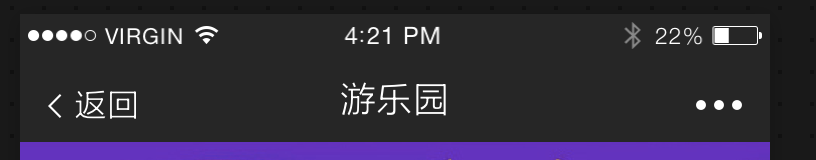


**操作步骤**

1. 在 app.json 中的 window 配置项下设置顶部导航栏的：背景色、标题文字、标题颜色

```json
{
  "window": {
     "navigationBarBackgroundColor": "#262626",
     "navigationBarTitleText": "FC游乐园",
     "navigationBarTextStyle": "white"
  }
}
```


**本章问题**

- Q1：顶部导航栏的哪些部分可以配置？

---


## 全局配置：设置窗口外观

> 改变小程序窗口的外观


**操作步骤**

1. 在 app.json 的 window 下，配置 backgroundColor，用来改变窗口背景色
2. 添加配置项 enablePullDownRefresh

3. 下拉页面，查看效果


**本章问题**

- Q1：本章演示中，为什么配置了窗口背景色后，还要配置 enablePullDownRefresh?

---


## 全局配置：下拉刷新和上拉加载

> 了解如何实现小程序中下拉刷新和上拉加载效果


**实现下拉刷新的方法：**

1. 在 `app.json` 的 `window` 下配置 `"enablePullDownRefresh": true`

2. 在页面 JS 代码中，添加监听函数 `onPullDownRefresh()`


**实现上拉加载的方法：**

1. 在 `app.json` 的 `window` 下配置 `"onReachBottomDistance": 200`   设置触底的距离

2. 在页面 JS 代码中，添加监听函数 `onReachBottom()`


**本章问题**

- Q1：实现下拉刷新需要用到哪些配置和方法？
- Q2：实现上拉加载需要用到哪些配置和方法？

---


‘’

‘

## 全局配置：设置标签导航栏

> 实现小程序底部的标签导航栏


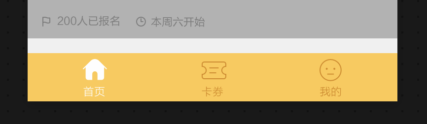


**操作步骤**

1. 复制图标文件到代码目录 assets 下
2. 创建三个新页面：首页、卡券、我的

```json
{
	"pages": [
		"pages/index/index",
		"pages/cards/cards",
		"pages/center/center"
	]
}
```

3. 配置 app.json 的 tabBar 实现包含3个按钮的标签式导航栏

```json
  "tabBar": {
    "list": [
      {
        "text": "首页",
        "pagePath": "pages/index/index",
        "iconPath": "assets/icons/home-default.png",
        "selectedIconPath": "assets/icons/home-active.png"
      },
      {
        "text": "卡券",
        "pagePath": "pages/cards/cards",
        "iconPath": "assets/icons/cards-default.png",
        "selectedIconPath": "assets/icons/cards-active.png"
      },
      {
        "text": "我的",
        "pagePath": "pages/center/center",
        "iconPath": "assets/icons/face-default.png",
        "selectedIconPath": "assets/icons/face-active.png"
      }
    ]
  }
```

4. 通过 app.json 中的 tabBar 下的其他配置改变标签式导航栏的按钮文字颜色、背景色等外观

```json
  "tabBar": {
    "color": "#D78B09",
    "selectedColor": "#FFF",
    "backgroundColor": "#FECA49",
    "borderStyle": "white",
    
    "list": [
      ...
    ] 
  }
```


**本章问题**

- Q1：标签式导航栏的按钮在哪里进行配置？
- Q2：标签式导航栏的背景色怎么配置？

---


## 页面配置：针对某页面的个性化配置

> 将之前示例中 “我的” 标签页的顶部导航栏，个性化配置成如下图所示的样子

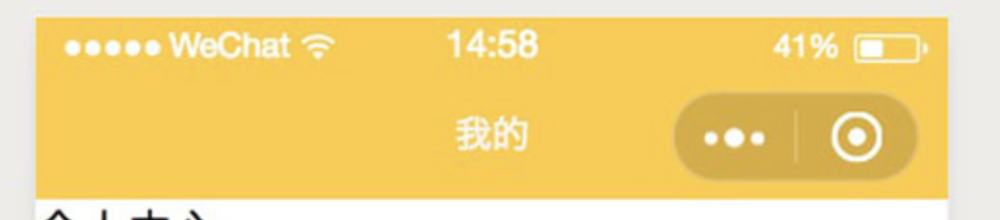


在“我的”页面的json文件中配置顶部导航栏的：背景色、标题文字、标题颜色

```json
{
  "navigationBarBackgroundColor": "#FECA49",
  "navigationBarTitleText": "我的",
  "navigationBarTextStyle": "white",
}
```


**本章问题**

- Q1：页面级别的配置在哪里编写？
- Q2：页面配置和全局配置的优先级哪个更高?

---


## 数据操作：数据绑定

> 将数据绑定到组件上，以便让它们渲染到页面


**概念介绍**

- 页面渲染相关的数据放在`Page.data` 中

- 页面模板中绑定要渲染的数据使用 `{{ }}`


**操作步骤**

1. 在页面 js 中定义参与页面渲染的数据

```javascript
Page({
	data: {
  	msg: 'Hello,world',  // 字符串
    num: 123,          	 // 数字
    className: 'box',    // 一个 class 样式
    bgColor: 'red'       // 一个 style 样式
  }
})
```

2. 在页面 wxml 中使用 {{ }} 绑定数据

```xml
<!-- ========= 在标签内绑定数据 ========= -->
<view>{{ msg }}</view>

<!-- ========= 在属性上绑定数据 ========= -->
<view data-num="{{ num }}"
      class="{{ className }}" 
      style="background-color: {{ bgColor }}">
  {{ msg }}
</view>
```


**本章问题**

- Q1：小程序要渲染到页面中的数据，应该放在代码中的哪个地方？
- Q2：小程序的数据绑定语法是什么样的？

---


## 数据操作：插值表达式详解

> 了解小程序插值表达式的更多语法细节


**概念介绍**

小程序的插值表达式内支持：

- 数据属性（message）

- 路径运算（list[0]、obj.name）
- 算术运算（+、-、*、/）
- 逻辑运算（>、>=、<、<=、==、===）
- 三元运算（true ? 1 : 2）
- 字符串连接（+）


小程序的插值表达式内不支持：

- 函数调用（如 `{{ str.split(',') }}`、`{{ test1(str) }}`）
- 完整语句（含有js关键字）


**本章问题**

- Q1：小程序的插值表达式中，不支持什么内容？

---


## 数据操作：列表渲染

> 将数组数据渲染到页面上，显示成列表结构


**概念介绍**

列表渲染就是在页面的某个位置上，将一个数组数据遍历生成结构相同的一组界面元素。

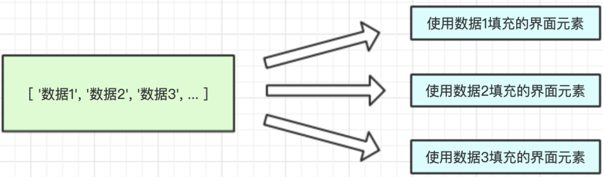

语法：

- `wx:for="{{数据}}"`  
- 默认由 `item` 和 `index` 两个变量来获取当前遍历的数据和索引


**操作步骤**

1. 准备一个数组数据

```js
Page({
	data: {
		list: ["hello", "world", "foo", "bar"]
	}
})
```


2. 编写页面列表结构的一个列表项

```xml
<view>
  <text>序号: 111</text>
  <text>内容: xxx</text>
</view>
```


3. 在列表项上添加 wx:for="{{ xxx }}" ，以及使用 item 和 index 变量完成列表渲染

```xml
<view wx:for="{{ list }}">
  <text>序号: {{index}}</text>
  <text>内容: {{item}}</text>
</view>
```


**本章问题**

- Q1：小程序的列表渲染语法是什么？
- Q2：列表渲染中使用哪些变量来访问数据？

---


## 数据操作：列表渲染 - 更改默认变量

> 修改列表渲染中的默认变量名 item 和 index


**概念介绍**

通过在含有 `wx:for` 的标签上添加 `wx:for-item="新元素变量名"` 和 `wx:for-index="新索引变量名"` 进行修改。


**操作步骤：**

1. 使用 wx:for-item 来自定义默认的循环数据变量名 item

```xml
<view wx:for="{{ list }}" wx:for-item="myItem">
```


2. 使用 wx:for-index 来自定义默认的循环索引变量名 index

```xml
<view wx:for="{{ list }}" wx:for-index="myIndex">
```


**本章问题**

- Q1：修改列表渲染默认元素和索引变量名的是哪两个属性？

---


## 数据操作：列表渲染 - 性能优化

> 为列表渲染的元素添加 wx:key 属性来提升渲染性能


**概念介绍**

当为列表元素设置 `wx:key` 属性值后，会在列表发生重新渲染时，依据 `wx:key` 的值对新数组元素做唯一性鉴定，**判断是否复用现有组件实例**。


这种机制称为 “**本地复用策略**”。


**wx:key 合法值：**

- 数组元素是对象时：设置为对象中代表唯一性的属性名，如 `wx:key="id"`
- 数组元素是字符串或数字时：设置为 `wx:key="*this"`


**本章问题**

- Q1：小程序的列表渲染本地复用策略，它使用的属性名叫什么？
- Q2：`*this` 应该在什么情况下使用？

---


## 数据操作：条件渲染

> 通过逻辑条件来控制组件是否显示


**概念介绍**

语法：

`wx:if="{{条件一}}"`

`wx:elif="{{条件二}}"`

`wx:else`


**操作步骤**

1. 在 page.js 中定义一个数据

```js
Page({
  data: {
  	year: 0
  }
})
```


2. 在 page.wxml 中编写所有可能显示的组件

```xml
<view>外行</view>
<view>初级程序员</view>
<view>中级程序员</view>
<view>高级程序员</view>
```


3. 在组件上添加条件渲染属性

```xml
<view wx:if="{{ year <= 0 }}">外行</view>
<view wx:elif="{{ year > 0 && year <= 3 }}">初级程序员</view>
<view wx:elif="{{ year > 3 && year <= 6 }}">中级程序员</view>
<view wx:else>高级程序员</view>
```


**本章问题**

- Q1：实现小程序条件渲染的属性分别有哪些？

---


## 数据操作：block标签

> 使用 <block> 标签将控制属性（列表渲染或条件渲染的熟悉）从组件上分离出去


好处：

- 提高代码可读性
- 可以提升某些场景下的性能
- 不会创建额外的组件实例


条件渲染示例：

```xml
<view wx:if="{{ isShow }}">A</view>

<block wx:if="{{ isShow }}">
  <view>A</view>
</block>
```

列表渲染示例：

```xml
<view wx:for="{{books}}">
	{{ item.name }}
</view>

<block wx:for="{{books}}" wx:key="id">
  <view>{{ item.name }}</view>
</block>
```


**本章问题**

- Q1：使用block有哪些好处？

---


## 事件处理：捕获与冒泡

> 复习：事件在捕获和冒泡阶段的传播顺序


**概念介绍**

一、捕获阶段

事件从最外层组件向事件目标组件一层层传递


二、冒泡阶段

事件从目标组件向最外层组件一层层传递

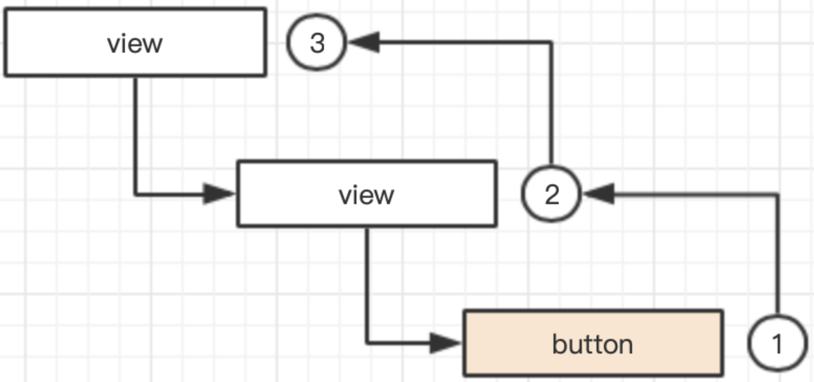


**本章问题**

- Q1：请用一句话描述事件捕获和冒泡的顺序

---


## 事件处理：添加事件监听

> 为小程序组件添加事件监听


**概念介绍**

语法：

```
bind事件名="事件监听函数名"
bind:事件名="事件监听函数名"
```


**操作步骤**

1. 编写 button 组件，并使用`bind事件名` 或 `bind:事件名`添加点击事件

```xml
<button bindtap="tapHandler">按钮</button>
<button bind:tap="tapHandler">按钮</button>
```

2. 在页面js中添加事件监听函数


```javascript
Page({
  // 事件监听函数
	tapHandler() {
  	console.log('按钮被点击啦！')
  }
})
```


**本章问题**

- Q1：为组件绑定一个点击事件需要添加什么属性？

---


## 事件处理：事件冒泡

> 实现点击子组件后，当前组件和它的父组件都能触发点击事件


```
<div onclick=""
document.getElementById('xxx').onclick = function() {}
document.getElementById('xxx').addEventListener('click', function() {})
```


**概念介绍**

使用 `bind事件名` 监听的是事件的冒泡阶段，因此事件在当前组件上处理完后会继续向父组件传递，触发父组件上的事件监听。


**操作步骤**

1. 在 wxml 中编写两个父子结构的组件，并添加 tap 事件监听

```xml
<view class="parent" bind:tap="foo">
  <view class="child" bind:tap="bar"></view>
</view>
```

2. 在页面js中编写事件监听函数

```javascript
Page({
  foo () {
    console.log('parent');
  },
  bar () {
    console.log('child');
  }
});
```


**本章问题**

- Q1：在组件上添加 `bind事件名` 后，事件在当前组件上处理完后会向谁继续传递？

---


## 事件处理：阻止冒泡

> 实现点击子组件后，事件不再继续向父组件传递的效果（即父组件的事件监听不会被触发）

```
@click.stop
e.stopPropagation()
```


**概念介绍**

语法：

```
catch事件名="事件监听函数"
catch:事件名="事件监听函数"
```


**操作步骤**

1. 在 wxml 中编写两个父子结构的组件，并使用 `catch事件名` 代替 `bind事件名` 进行事件监听

```xml
<view class="parent" bind:tap="foo">
  <view class="child" catch:tap="bar"></view>
</view>
```

2. 在页面js中编写事件监听函数

```javascript
Page({
  foo () {
    console.log('parent');
  },
  bar () {
    console.log('child');
  }
});
```


**本章问题**

- Q1：阻止事件冒泡的语法是什么？

---


## 事件处理：事件捕获

> 实现以捕获阶段的顺序触发事件（从外到里）


**概念介绍**

- 捕获顺序传递的事件绑定语法：`capture-bind:事件名`

- 阻止捕获事件继续传递的语法：`capture-catch:事件名`


**操作步骤**

1. 在 wxml 中编写两个父子结构的组件，并使用 `catch事件名` 代替 `bind事件名` 进行事件监听

```xml
<view class="parent" capture-bind:tap="foo">
  <view class="child" capture-bind:tap="bar"></view>
</view>
```


2. 在页面js中编写事件监听函数

```javascript
Page({
  foo () {
    console.log('parent');
  },
  bar () {
    console.log('child');
  }
});
```


3. 在父元素使用 capture-catch 来阻止事件的捕获传递

```javascript
<view class="parent" capture-catch:tap="foo">
  <view class="child" capture-bind:tap="bar"></view>
</view>
```


**本章问题**

- Q1：怎么以捕获的顺序传递事件？
- Q2：怎么阻止事件的捕获传递？

---


## 事件处理：事件对象与参数传递

> 了解事件对象的获取，以及如何通过事件对象传递数据


**概念介绍**

可以通过事件监听函数的第一个参数来获取事件对象。

可以通过组件的自定义属性（data-xxx）向事件监听函数传递额外的数据。


**操作步骤**

1. 在页面中使用组件 view 并添加自定义属性

```xml
<view data-name="小明">点我试试</view>
```


2. 为组件添加事件监听

```xml
<view data-name="小明" bind:tap="tapHandler">点我试试</view>
```


3. 在js中添加监听函数，并获取事件对象

```js
Page({
  tapHandler(e) {
    // 参数 e 即为事件对象
    console.log(e);
  }
});
```


4. 通过事件对象的 target.dataset 获取组件上的自定义属性值

```js
Page({
  tapHandler(e) {
    // 获取触发事件的目标组件上的自定义属性值
    console.log(e.target.dataset);
  }
});
```


**本章问题**

- Q1：怎么获取事件对象？
- Q2：怎么为事件监听函数传递额外的数据？

---


## 数据更新：setData方法

> 修改页面中动态渲染的数据


**概念介绍**

修改Page.data的话，可以调用小程序页面js中的页面实例方法`this.setData()`


`setData()` 的参数：

```js
this.setData(
 	// 第一个参数：要更新的数据
  {
   data1: ....,
   data2: ....
	},
  // 第二个参数：在数据更新并重新渲染完成后执行的回调函数
  () => { 
    // ... 
  }
)
```


**操作步骤**

1. 在 page.js 中定义视图要使用的数据

```js
Page({
  data: {
    message: "Hello,World"
  }
})
```


2. 在 page.wxml 中编写一个 view 组件并展示 data 中的 message 数据

```xml
<view>{{ message }}</view>
```


3. 在 page.wxml 中编写一个按钮并添加事件监听，并调用 setData 更新 message 数据

```xml
<view>{{ message }}</view>
<button bindtap="clickHandler">点击更新数据</button>
```

```js
Page({
  data: {
    message: "Hello,World"
  },
  clickHandler() {
   	this.setData({
      message: "你好世界"
    })
  }
})
```


**本章问题**

- Q1：页面要更新数据，调用什么方法？
- Q2：该方法第一个和第二个参数分别是什么作用？

---


## 数据更新：setData在做什么

> 了解 setData 的原理


**概念介绍**

setData 在执行时主要会做以下两件事：

1. 使用同步的形式，更新逻辑层的 `this.data` 中的数据
1. 使用异步的形式，将数据从逻辑层发送到视图层，触发视图层的重新渲染


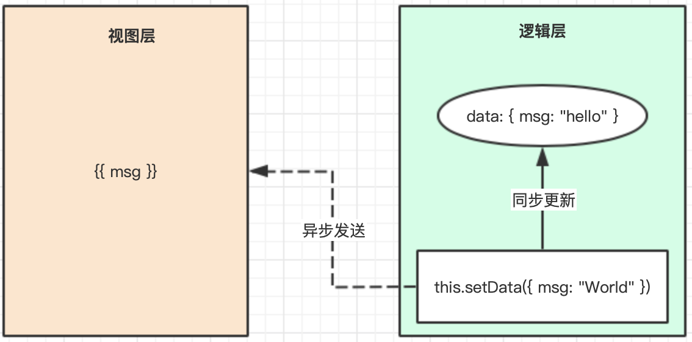


setData 使用时的注意点：

1. 不要一次发送大量数据（< 1024kb），容易造成视图更新迟缓 
1. 不在循环中调用 setData，容易导致界面卡顿


**本章问题**

- Q1：setData更新数据是同步还是异步？
- Q2：setData更新界面是同步还是异步？

---


## 小程序 API：介绍

>  了解小程序 API 的功能和形式


API 文档地址：https://developers.weixin.qq.com/miniprogram/dev/api/


**概念介绍**

小程序 API 提供了很多功能，如：路由导航、显示弹框等、网络请求、文件操作、设备信息、地理定位、本地存储等等。


这些 API 都包含在全局对象 `wx` 中，并且分为同步和异步：

1. 以 `Sync` 结尾的是同步的

2. 其他都是异步的，且异步 API 的参数都是一个对象，里面都包含了 3 个回调函数：

   - success：调用成功时执行

   - fail： 调用失败时执行

   - complete：调用成功或失败时都会执行


**本章问题**

- Q1：如何识别一个小程序 API 是同步还是异步的？

---


## 小程序 API：网络相关

> 了解发起网络请求的 API


**概念介绍**

1. wx.request 发起网络请求
2. wx.uploadFile 上传文件


【注意】

- 在调用一个域名上的接口时，要先在小程序管理后台中配置域名白名单，即允许小程序调用该域名下的接口

- 在本地开发时，也可在开发者工具中设置不检查域名


**本章问题**

- Q1：调用普通接口，要用哪个小程序 API？
- Q2：文件上传功能，要用哪个小程序 API？

---


## 小程序 API：界面相关

> 了解界面弹窗相关的API


**概念介绍**

1. wx.showLoading / wx.hideLoading：显示/隐藏加载框
3. wx.showModal：显示确认框
3. wx.showToast：显示提示框


**本章问题**

---


## 小程序 API：媒体相关

> 了解图片选择和图片展示相关的API


**概念介绍**

1. wx.chooseImage：从手机相册选择照片，或使用手机相机拍照
2. wx.previewImage：图片预览展示（只能预览网络图片，不能是本地图片）


**本章问题**

---


## 小程序 API：路由相关

> 了解编程式路由相关的API

路由栈（先进后出）


**概念介绍**

1. wx.navigateTo：跳转到应用内的某个页面，不能跳到 tabbar 页面 （push）
3. wx.redirectTo：重定向的方式跳转到应用内的某个页面，不能跳到 tabbar 页面（replace）

3. wx.switchTab：跳转到 tabBar 页面


**本章问题**

---


## 小程序 API：缓存相关

> 了解本地缓存相关的API


**概念介绍**

缓存 API 提供了同步和异步版本。在实际开发中的使用原则是：

- 如果一次缓存的数据量较大时，推荐使用异步 API
- 否则推荐使用同步 API


1. setStorage / setStorageSync：设置一个缓存数据
2. getStorage / getStorageSync：获取一个缓存数据
3. removeStorage / removeStorageSync：删除一个缓存数据
4. clearStorage / clearStorageSync：清空所有缓存数据
5. getStorageInfo / getStorageInfoSync：获取缓存状态信息


**本章问题**

---


## 生命周期：什么是生命周期

> 了解生命周期的作用及小程序生命周期的分类


**概念介绍**

- **生命周期**，是框架代码在运行的过程中会经历的某些特定时间节点。

- **生命周期钩子函数**，是框架代码运行到特定生命周期时会调用的函数。


以小程序为例，小程序框架会按某种特定的流程执行，并允许开发人员编写在特定阶段才会执行的代码，当小程序框架代码运行到这些阶段时，开发人员的代码被随之执行。


小程序中的生命周期一共有两类：**应用生命周期、页面生命周期**。


**本章问题**

- Q1：小程序中的生命周期分为哪几类？

---


## 生命周期：应用的生命周期

> 监听小程序应用级别的生命周期


**操作步骤**

1. 在 app.js 中调用 App 函数来注册应用实例

```js
App({
  
})
```


2. 在 App() 的参数中定义：onLaunch、onShow、onHide  等生命周期钩子函数

```js
App({
  
  // 小程序启动时
  onLaunch: function () {
    // 全局只会触发1次
    console.log('小程序启动了...');
  },
  
  // 小程序前台运行时
  onShow: function () {
    // 重复执行
    console.log('小程序前台运行了...');
  },
  
  // 小程序后台运行时
  onHide: function () {
    // 重复执行
    console.log('小程序后台运行了...');
  },
  
})
```


**本章问题**

- Q1：应用生命周期代码应该在哪个文件中编写？

---


## 生命周期：页面的生命周期

> 监听小程序页面级别的生命周期


**操作步骤**

1. 生成一个新页面


2. 页面js中的生命周期钩子函数

```js
Page({
  
  // 页面加载时触发，只会触发1次
  onLoad: function () {
    console.log('当前页面被加载了...');
  },
  
  // 当前页面初次渲染完毕时触发，只会触发1次
  onReady: function () {
    console.log('当前页面初次渲染完毕了...');
  },
  
  // 页面显示时触发（如返回、tabBar切换、前台运行）
  onShow: function () {
    console.log('当前页面显示了...');
  },
  
  // 页面隐藏时触发（跳转、tabBar切换、后台运行）
  onHide: function () {
    console.log('当前页面不见了...');
  }
  
})
```


**本章问题**

- Q1：页面生命周期代码，应写在哪个代码文件中？
- Q2：onLoad 在什么时候执行？
- Q3：onShow/onHide在什么时候执行？

---


## 生命周期：场景值

> 获知用户是通过什么途经进入到我们的小程序的


**概念介绍**

打开小程序的方式多种多样，比如扫码、转发、搜索、公众号等。

通过场景值可以分辨出用户是以何种途径打开我们的小程序的。


场景值的实际作用：

1. 可以在程序中，按照不同的场景值为用户展示不同的界面
2. 可以用来统计热门入口，帮助改善市场推广的策略，提升推广效率，降低推广成本


**操作步骤**

1. 在app.js中添加生命周期钩子函数 `onLaunch` 和 `onShow`

```js
App({
  onLaunch() {
  },
  onShow() {
  }
})
```


2. 为 onLaunch 和 onShow 添加参数 options，场景值就包含在 options 参数内

```js
App({
  onLaunch(options) {
  	// 根据打开小程序的方式不同 options.scene 的值也不一样
    console.log(options.scene);
  },
  
  onShow(options) {
  	// 这里也可以获取场景值
    console.log(options.scene);
  }
})
```


3. 模拟不同场景进入小程序

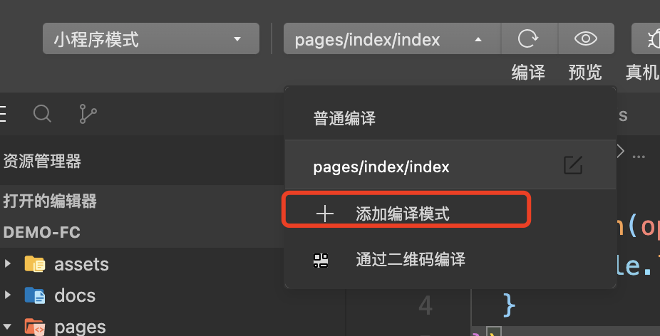

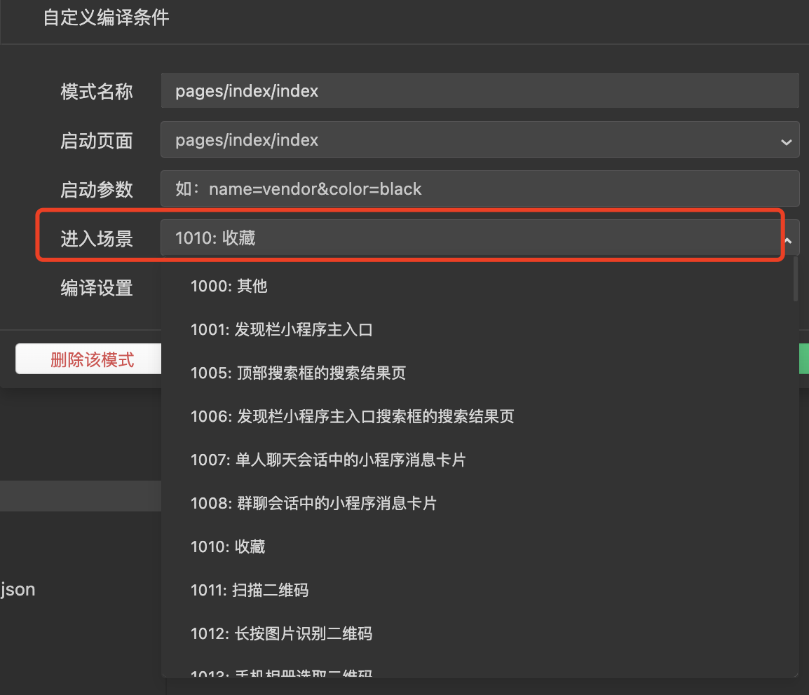


**本章问题**

- Q1：从什么地方可以获取到场景值？
- Q2：说出一个场景值的用途？

---


## 生命周期：页面跳转时传参

> 通过小程序的页面路径传参，并在目标页面中获取这些参数

```
xxxxx?a=1&b=2
```


**概念介绍**

在通过页面路径访问小程序页面时，可在路径中携带查询字符串形式的参数，如：

`/pages/test1/test1?name=Tom&age=12`


然后在该页面的js代码中，可通过生命周期钩子 `onLoad`的参数获取传入的参数:

```js
onLoad(options)
```


**操作步骤**

1. 创建两个页面如：`pages/page1/page1`和`pages/page2/page2`

   

2. 在 page1 中放 <navigator> 组件用于页面跳转，并在路径中添加一些参数

```xml
<navigator url="/pages/page2/page2?name=Kevin&age=18">跳转到page2页面</navigator>
```


3. 在 page2 的 JS 中添加 `onLoad` 生命周期函数并打印参数

```js
Page({
	onLoad(options) {
    // 得到路径上传递的参数
	  console.log(options)
	}
})
```


**本章问题**

- Q1：如何获取页面路径上传递的参数？

---


## JS模块化：模块规范

> 编写和调用小程序的 JS 模块

CommonJS

- require('')
- exports/module.exports


ESM

- import
- export


**概念介绍**

小程序的 JavaScript 模块化规范遵循的是 CommonJS，和 Node.js 中完全一致。

语法：

- 导出模块 `module.exports`
- 导入模块 `require()`


**操作步骤**

1. 在 utils 目录创建一个 common.js 模块文件


2. 在 common.js 中编写一个函数，并导出

```js
function toUpperCase(str) {
  if (!str) {
     return ""
  }
	return str.toUpperCase()
}

module.exports = {
  toUpperCase: toUpperCase
}
```


3. 在需要调用这个js模块的其他js代码中，导入common.js

```js
const common = require('../../utils/common.js')
```


4. 调用common.js中导出的函数

```js
const result = common.toUpperCase("hello,world")  
```


**本章问题**

- Q1：小程序使用的js模块规范叫什么？
- Q2：导入和导出js模块使用什么语法？

---


## JS模块化：使用 npm

> 在小程序中使用通过 npm 下载的模块


**概念介绍**

在小程序中使用 npm 下载的模块包，要经过以下几个过程：

1. 确保项目下是否有package.json，如果没有则创建
2. 下载 npm 包
3. 构建 npm 包
4. 设置项目启用对 npm 的支持
5. 在代码中引入并调用 npm 包中的内容


注意事项：

小程序基础库为 `2.2.1` 或以上版本，及微信开发者工具 1.02.1808300 或以上版本，才支持以上功能。


**操作步骤**

1. 使用 npm 安装一个模块，比如 lodash.trim

```bash
# 初始化
npm init -y

# 安装 lodash.trim 模块
npm i lodash.trim
```

2. 点击微信开发者工具的 “工具” -> “构建npm” 菜单

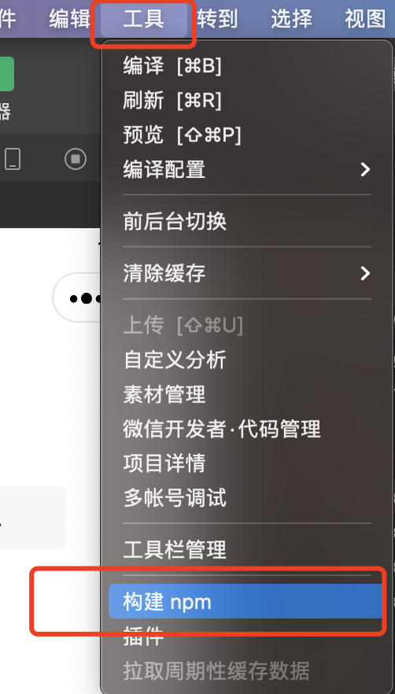

构建完成后工程中会多出一个 miniprogram_npm 目录：


3. 在详情面板的“本地设置”中勾选"使用npm模块"

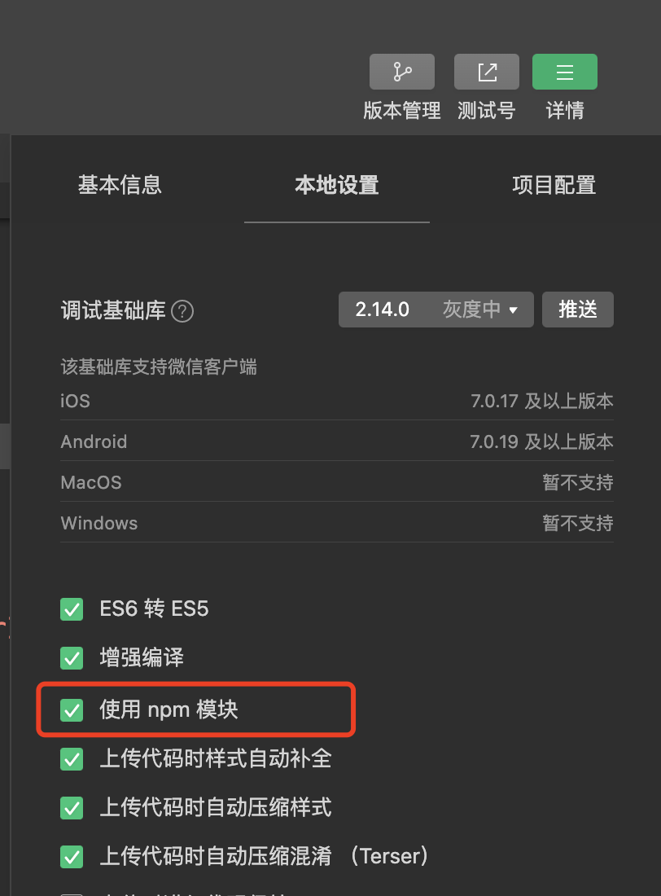

4. 在某页面的 js 代码中导入 lodash.trim 模块并调用

```js
// 引入模块
const trim = require('lodash.trim')

Page({
  
  onLoad() {
    // 调用模块
    const result = trim("   Hello,World    ")
    console.log(result)
  }
  
})
```


**本章问题**

- Q1：描述一下在小程序中使用npm包的步骤？

---


## JS模块化：全局数据

> 了解小程序中定义可被全局访问的函数或变量的一种方式


**概念介绍**

思考：如果有需要被全局访问的数据或函数，应该放到哪里？

方案：放在 `app.js` 中的 App 实例上

语法：调用 `getApp()` 即可获取 App 实例


**操作步骤**

1. 将需要全局访问的数据/函数放在 app.js 文件内调用的 App() 函数对象参数中

```js
App({
  
  // 定义全局访问的数据
  name: '小明',
  
  // 定义全局访问的函数
  sayHi() {
    console.log('你好' + this.name);
  }
  
})
```

2. 在页面的 js 中使用 getApp() 函数获取 App 实例（即 app.json 中定义的内容）

```js
// getApp 是小程序内置提供的函数，用于获取全局应用实例
const app = getApp()
```

3. 通过 App 实例，调用它上面存放的全局数据/函数

```js
// getApp 是小程序内置提供的函数，用于获取全局应用实例
const app = getApp()

Page({
  
  onLoad() {
    // 访问全局数据
    console.log(app.name)
    // 调用全局函数
    app.sayHi();
  }
  
})
```


**本章问题**

- Q1：如何在js中获取小程序应用实例？
- Q2：在应用实例上存放全局数据是不是唯一的方式？

---


## WXS：背景介绍

> 了解什么是 WXS 以及为什么需要 WXS


**什么是 WXS？**

它是一套运行在小程序渲染层的脚本语言，与 JavaScript 是不同的语言，但语法和 JavaScript 非常雷同。

它的目的是解决 WXML 中无法调用函数的问题。


**为什么 WXML 中无法调用函数呢？**

因为小程序架构设计上的限制。

小程序运行环境内部被分两个部分：渲染层和逻辑层，且之间不能互相直接访问。

- 渲染层职责：执行 WXML 和 WXSS 代码
- 逻辑层职责：执行 JavaScript 代码
- 两层之间通信：通过 Native 层（也就是微信本身）

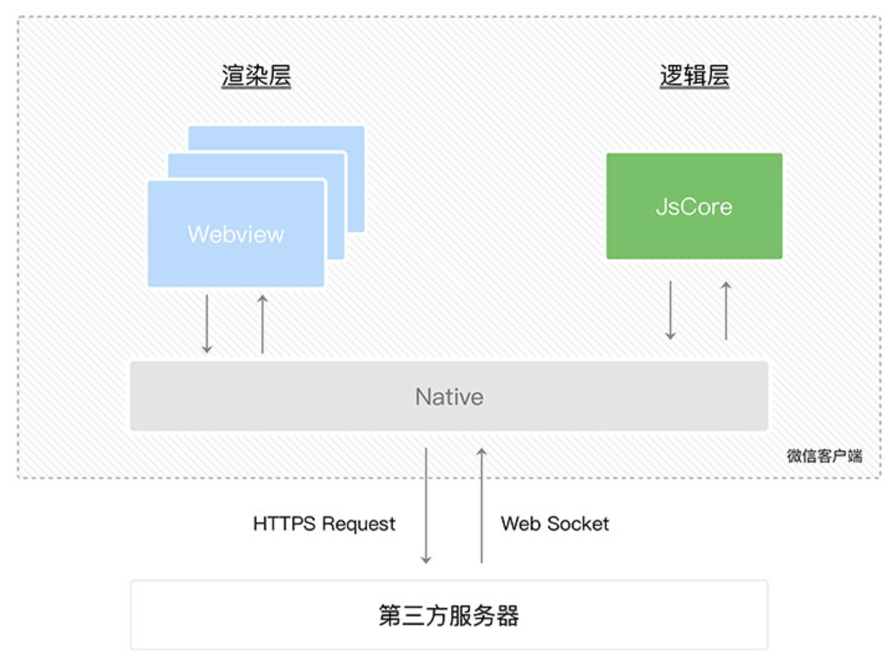


**本章问题**

- Q1：WXS 运行在什么层？
- Q2：JavaScript 运行在什么层？
- Q3：WXML 运行在什么层？

---


## WXS：基本用法

> 实现点击按钮后，调用WXS代码来在控制台打印一个信息


**WXS 与 JS 的语法主要差异（更多语法参考 [官方文档](https://developers.weixin.qq.com/miniprogram/dev/reference/wxs/)）：**

- 变量声明只能用 **var** 
- 变量名不能有 **$**
- 不能用关键字 **new**
- 模块导出语句不能简写（如： `module.exports = { xxxx: xxxx }`）


**在WXML中声明WXS代码块**

- 使用 `<wxs>`标签，并且必须设置 `module` 属性
- 在 `<wxs>` 标签内直接编写代码，或通过 `src` 引入独立的 `.wxs` 文件


**在WXML中调用WXS**

使用插值表达式：{{ module名.导出名 }}


**操作步骤**

1. 在页面文件中放一个wxs标签，并设置module属性，然后编写一个简单的WXS函数

```xml
<!-- wxs 标签必须指定 module 属性 -->
<wxs module="m1">
  function printMsg() {
  	console.log('WXS脚本打印的信息...');
  }
  
  module.exports = {
  	printMsg: printMsg
  }
</wxs>
```


2. 编写按钮，并在点击事件中调用以上WXS函数

```xml
<button bindtap="{{ m1.printMsg() }}">打印</button>
```


3. 创建一个 m2.wxs 文件，并将之前wxs标签下的代码移入该文件中


4. 在页面文件中通过wxs标签引入 m2.wxs

```xml
<wxs module="m2" src="../../utils/m2.wxs"></wxs>
```


**本章问题**

- Q1：WXS代码可以编写在什么文件中？
- Q2：使用什么标签声明wxs代码块？
- Q3：如何在WXML组件上调用WXS代码？

---


## WXS：应用场景

> WXS 的高频应用场景是对页面数据的格式化


本章节实现对一个 wxs 版本的日期格式化函数，对时间戳数据进行格式化。


**操作步骤**

1. 新建 date.wxs 文件，编写一个日期格式化函数并导出

```js
function format(timestamp) {
  // 通过 getDate() 将时间戳转换成日期对象
  var d = getDate(timestamp);
  return d.getFullYear() + '年' + (d.getMonth() + 1) + '月' d.getDate() + '日';
}

module.exports = {
  format: format
}
```


2. 在wxml文件中使用wxs标签引入date.wxs，并设置module属性

```xml
<wxs module="mDate" src="../../utils/date.wxs"></wxs>
```


3. 在页面的js中准备一个日期时间戳数据

```js
Page({
  data: {
    now: Date.now()
  }  
})
```


4. 在wxml文件中使用插值表达式调用wxs模块中的日期格式化函数

```xml
<view class="now">{{ mDate.format(now) }}</view>
```


**本章问题**

- Q1：在 WXS 中如何将时间戳格转为 Date 对象？

---


## 表单：常用表单组件

> 了解小程序中的常用表单组件


**概念介绍**

1. 文本框：input 
2. 密码框：input
3. 单选框：radio、radio-group 
4. 多选框：checkbox、checkbox-group 
5. 底部弹起的选择框：picker


**操作步骤**

使用小程序提供的表单组件，定义界面，如常见的登录/注册：

```xml
<form>
  <view class="item">
    <label for="">姓名: </label>
    <input type="text" />
  </view>
  
  <view class="item">
    <label for="">密码:</label>
    <input type="text" password />
  </view>
  
  <view class="item">
    <button type="primary">保存</button>
  </view>
</form>
```

在小程序中，有些组件与网页是**不一致**的，比如复选框、单选框、下拉选择框等：

```xml
<form>
  .....
  
  <!-- 单选 -->
  <view class="item">
    <label for="">性别: </label>
    <radio-group>
      <radio value="男" />男
      <radio value="女" />女
    </radio-group>
  </view>
	
  <!-- 复选 -->
  <view class="item">
    <label for="">爱好: </label>
    <checkbox-group>
      <checkbox value="睡大觉" />睡大觉
      <checkbox value="写代码" />写代码
    </checkbox-group>
  </view>
  
  <!-- 下拉选择框 -->
  <view class="item">
    <label for="">级别: </label>
    <picker range="{{['初级', '中级', '高级']}}">
      <view class="grade">初级</view>
    </picker>
  </view>
  
  <view class="item">
    <button type="primary">保存</button>
  </view>
</form>
```


**本章问题**

- Q1：单选框应该用什么组件？
- Q2：复选框应该用什么组件？

---


## 表单：获取表单数据

> 获取填写后的表单数据


**概念介绍**

表单的主要职责是：收集用户填写的数据，然后将数据提交到服务端处理。


```markdown
一个能正常获取数据的表单，应包含以下特征：

1. 使用 <form> 包裹并设置了 submit 事件监听
2. 每个表单项都设置了 name 属性
3. 包含一个设置了 form-type="submit" 的 <button> 按钮 

这样的表单，就能在 submit 事件监听函数中，通过 e.detail 获取表单数据。
```


**操作步骤**

1. 编写表单结构

```xml
<!-- 监听表单提交事件 -->
<form bind:submit="send">
  
  <view class="item">
    <label for="">姓名: </label>
    <input type="text" name="username" />
  </view>
  
  <view class="item">
    <label for="">密码:</label>
    <input type="text" name="password" password />
  </view>
  
  <view class="item">
    <!-- 指定 button 组件的 form-type 属性为 submit -->
    <button type="primary" form-type="submit">保存</button>
  </view>
</form>
```

2. 获取表单数据

```js
Page({
  data: {},
  send (e) {
    // 通过 ev.detail 获取 input 组件中的数据
    console.log(e.detail);
  }
})
```


**本章问题**

- Q1：表单项上需要设置什么属性才能获取到数据？
- Q2：`<form>` 组件上需要监听什么事件？
- Q3：从事件对象的属性上获取表单属性？

---


## 自定义组件：创建组件

> 创建一个简单的小程序组件


**概念介绍**

自定义组件与小程序页面的文件构成非常类似，一个组件也是由4个文件组成。


创建方式：通过菜单自动生成、或手动创建。


**操作步骤**

1. 在项目根目录创建 components 目录
2. 在 components 目录下创建一个子目录存放一个组件，比如 header
3. 在 header 目录上点击鼠标右键，选择“创建Component”菜单
4. 输入组件名，完成创建


**本章问题**

- Q1：创建组件的菜单在哪里？

---


## 自定义组件：调用组件

>  在页面中调用自定义组件


**概念介绍**

要在页面或其他自定义组件中调用一个自定义组件，需要遵循以下步骤：

1. 在该页面或自定义组件的json配置中，通过 usingComponents 配置要调用的自定义组件路径
2. 在该页面的wxml中通过标签方式调用该组件


**操作步骤**

1. 现在一个页面的json配置文件中，导入要调用的组件：

```json
{
  usingComponents: {
    // 导入自定义组件
    header: '/components/header/header'
  }
}
```

2. 在页面wxml文件中使用组件

```xml
<!-- 使用自定义组件 -->
<header />
```


**本章问题**

- Q1：自定义组件和页面中都可以调用其他自定义组件吗？
- Q2：调用自定义组件前，应该在哪里先引入该组件？

---


## 自定义组件：组件父传子

> 将父组件内的一些数据传给子组件使用


**概念介绍**

小程序的组件借鉴了很多Vue的理念，因此两者非常像，它的父传子是通过 properties 实现的。


**操作步骤**

```xml
<!-- 调用自定义组件，并传入属性数据 -->
<header title="{{title}}" />
```

```js
Page({
  // 父组件中的数据
  data: {
    title: '首页'
  }
})
```


**本章问题**

- Q1：小程序组件的父传子通过什么方式实现？

---


## 自定义组件：组件子传父

> 将子组件内的一些数据传递给父组件使用


**概念介绍**

小程序的子组件也能触发自定义事件，通过自定义事件携带子组件的数据到父组件中。

能触发自定义事件的函数：`this.triggerEvent('事件名', 数据)`


**操作步骤**

1. 在子组件中触发自定义事件，并携带要传递给父组件的数据：

```js
// components/header/index.js
Component({
  // ...
  
  // 组件方法
  methods: {
    sayHi: function () {
      this.setData({
        msg: '你好，世界!'
      })
      
      // 调用 triggerEvent 来触发自定义事件 myevent
      // 并且将 {name: '小明', age: 18} 做为参数，随自定义事件携带
      this.triggerEvent('myevent', {
        name: '小明', 
        age: 18
      });
    }
  }
})
```

2. 父组件调用子组件时，监听子组件的自定义事件：

```xml
<header list="{{navs}}" bind:myevent="myEventHandler" />
```

```js
Page({
  
  // 自定义事件的监听函数
  myEventHandler: function () {
    console.log('自定义事件触发了...');
  }
})
```


**本章问题**

- Q1：小程序中子组件通过什么方式传递数据给父组件？

---


## 自定义组件：组件库 Vant Weapp

> 在小程序项目中，安装使用小程序版的 Vant 组件库


**概念介绍**

[Vant Weapp](https://vant-contrib.gitee.io/vant-weapp) 是移动端 Vue 组件库 [Vant](https://github.com/youzan/vant) 的小程序版。

两者基于相同的视觉规范，提供一致的 API 接口，帮助开发者能快速的搭建小程序应用。


**操作步骤**

1. 按照小程序中使用 npm 包的方式安装和启用 Vant Weapp
2. 全局按需导入 Vant Weapp 中的组件
3. 调用 Vant Weapp 组件


**本章问题**

- Q1：如何全局导入组件？
