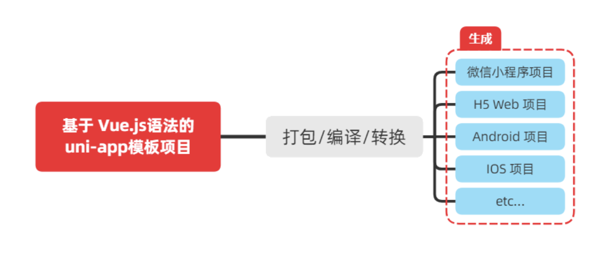

# 黑马优购：起步准备


## 起步：黑马优购项目简介

> 了解黑马优购项目案例


项目名称：黑马优购

项目类型：电商类-微信小程序

开发技术：uni-app框架


【真实项目运行效果演示】


---


## 起步：uni-app介绍

> uni-app 框架的功能和大致原理


**概念介绍**

[uni-app](https://uniapp.dcloud.net.cn/) 是一个使用 [Vue.js](https://vuejs.org/) 开发所有前端应用的框架，开发者编写一套代码，可发布到iOS、Android、Web（响应式）、以及各种小程序（微信/支付宝/百度/头条/QQ/钉钉/淘宝）、快应用等多个平台。


**uni-app 的实现原理：将 Vue 代码通过 webpack 翻译成其他平台的代码**




**本章问题**

1. 使用 uni-app 开发功能相同的网页程序和微信小程序，需要编写多套代码吗？
2. uni-app是如何将Vue代码转换成小程序代码的？


---


## 起步：开发工具

> 开发 uni-app 项目所需的工具


**概念介绍**

可用以下工具的组合来开发 uni-app 项目：

1. vue-cli + vscode + 微信开发者工具
2. [HBuilderX](https://www.dcloud.io/hbuilderx.html) + 微信开发者工具


**本章问题**

1. 在 uni-app 项目开发中，微信开发者工具扮演什么角色？

---


## 起步：新建项目

> 使用 Vue-CLI 创建 uni-app 项目


**操作步骤**

1. 全局安装 Vue CLI

```bash
npm install -g @vue/cli
```


2. 生成骨架代码

```bash
vue create -p dcloudio/uni-preset-vue myapp
```


---


## 起步：项目结构

> uni-app 项目目录和文件功能介绍


**概念介绍**

uni-app 项目的 src 目录，默认包含以下目录和文件：

```diff

┌─ pages                页面文件目录
│  └─ index
│     └─index.vue       index页面组件
│ 
├─ static                存放静态资源的目录。注意：静态资源只能存放于此
│ 
├─ main.js               Vue 入口文件
├─ App.vue               相当于小程序原生框架里的 app.js 和 app.json 的组合
│
├─ manifest.json         相当于加强版 project.config.json: 应用名、appid、logo、版本等信息
└─ pages.json            相当于小程序原生框架里的全局配置和页面配置的组合
```


**本章问题**

1. uni-app 开发小程序，AppID应该在哪个文件中配置？
2. uni-app 中页面的路径应该在哪个文件中配置？

---


## 起步：配置AppID

> 了解如何在 uniapp 中正确配置小程序的 AppID


**操作步骤**

1. 在 manifest.json 中的  mp-weixin 属性下，配置 appid：

```json
{
	"mp-weixin": {
		"appid": "xxxxxxxxxxxxxxx"
	}
}
```


---


## 起步：运行项目

> uni-app 项目分别以网页的形式、以及小程序的形式运行


**一、网页方式运行**

1. 执行 npm 命令运行

```bash
# npm 
npm run serve
```


**二、小程序方式运行**

1. 在 src/manifest.json 中填写 AppID

```json
{
	"mp-weixin": {
		"appid": "填写AppID"
	},
}
```


2. 使用 npm 构建代码

```bash
npm run dev:mp-weixin
```


3. 在微信开发者工具中导入 uni-app 项目下的 `dist/dev/mp-weixin` 


**本章问题**

1. uni-app 代码要运行成小程序，需要做哪几步？

---


## 起步：安装 SASS

> 为项目添加 SASS 支持，使用SASS编写样式代码
>
> 
>
> **【注意事项】**
>
> uni-ui 暂不支持最新版本 sass-loader，因此要将版本调整为较老版本：`"sass-loader": "^10.1.1"`


**操作步骤**

1. 安装 sass-loader 和 sass

```bash
npm i sass-loader@^10.1.1 sass
```


2. 在index页面组件中编写测试 scss 代码

```scss
<style lang="scss">
.test1 {
	background-color: yellow;
	
  .test2 {
  	color: red;
  }
}
</style>
```


**本章问题**

1. 使用 sass 需要安装哪些包？

---


## 起步：安装 uni-ui 组件库

> 安装uni-app官方提供的移动端UI组件库 uni-ui


本案例基于uni-ui组件库实现界面。[点击查看组件文档](https://hellouniapp.dcloud.net.cn/pages/extUI/icons/icons)


**操作步骤**

1. 安装 uni-ui

**【特别注意】最新版的 uni-ui 中存在某些严重 Bug！建议换成可正常使用的 1.2.10 版本。**

```bash
npm i @dcloudio/uni-ui@1.2.10
```


2. 配置按需引入机制：easycom

在 pages.json 中如下配置：

```json
"easycom": {
  "autoscan": true,
  "custom": {
    "^uni-(.*)": "@dcloudio/uni-ui/lib/uni-$1/uni-$1.vue"
  }
}
```

配置后即可在任意组件中调用 uni-ui 组件：

```xml
<uni-icons type="forward" size="30"></uni-icons>
```


**本章问题**

1. easycom 配置在哪个文件中？

---


## 起步：托管代码

> 将案例代码上传到Git服务器


**操作步骤**

1. 在任意一个Git服务网站上创建一个代码仓库
3. 将代码仓库的地址添加到本地项目
4. 上传本地项目到Git服务器


---


# 功能开发：导航

> 创建分支名：feature_navbar


## 导航：配置顶部导航栏

> 按照设计稿全局配置顶部导航栏


**操作步骤**

1. 修改 pages.json 中 globalStyle 相关配置

```json
{
	"globalStyle": {
		"navigationBarTextStyle": "white",
		"navigationBarTitleText": "黑马优购",
		"navigationBarBackgroundColor": "#C00000",
		"backgroundColor": "#FFFFFF"
	}
}
```


---


## 导航：配置tabBar-创建页面

> 创建四个标签按钮对应的4个页面组件


**操作步骤**

1. 在 pages 目录下，创建4个页面：
   - 首页 (home.vue)
   - 分类 (category.vue)
   - 购物车 (cart.vue)
   - 我的 (my.vue)
   
2. 在 pages.json 中，配置页面路径


---


## 导航：配置tabBar-导航栏配置

> 配置出底部标签式导航栏的效果


**操作步骤**

1. 将发放资料中的“黑马优购-静态资源”内的`static`目录，复制到当前项目的`src`目录


2. 修改 pages.json，编写 tabBar 相关配置

```json
{
  
	"tabBar": {
		"list": [
			{
				"pagePath": "pages/home/home",
				"text": "首页",
				"iconPath": "static/tabs/icon_home@3x.png",
				"selectedIconPath": "static/tabs/icon_home_active@3x.png"
			},
			{
				"pagePath": "pages/category/category",
				"text": "分类",
				"iconPath": "static/tabs/icon_category@3x.png",
				"selectedIconPath": "static/tabs/icon_category_active@3x.png"
			},
			{
				"pagePath": "pages/cart/cart",
				"text": "购物车",
				"iconPath": "static/tabs/icon_cart@3x.png",
				"selectedIconPath": "static/tabs/icon_cart_active@3x.png"
			},
			{
				"pagePath": "pages/my/my",
				"text": "我的",
				"iconPath": "static/tabs/icon_user@3x.png",
				"selectedIconPath": "static/tabs/icon_user_active@3x.png"
			}
		],
		"color": "#000000",
		"selectedColor": "#C00000"
	}
	
}
```


---


## 导航：提交合并与上传代码


**操作步骤**

1. 提交所有代码到 feature 分支
2. 切换到 develop 分支，拉取最新代码
3. 返回 feature 分支，将 develop 合并到 feature 分支
4. 将 feature 合并到 develop 分支
5. 上传到 Git 服务器
6. 删除 feature 分支


---


# 功能开发：首页

> 创建分支名：feature_home


## 首页：后端接口介绍

> 黑马优购项目后端接口的特征介绍


**概念介绍**

1. 接口域名地址：

```
https://www.uinav.com
```


2. 统一返回格式：

```json
{
    "meta": { 
			"status": 200,
      "msg": "获取成功"
    },
	  "message": null
}
```

**更多详情请查看发放资料中的：《微信小程序商城API文档.md》**


**本章问题**

1. 黑马优购的后端接口返回的数据中，哪个字段代表实际的数据？
2. 黑马优购的后端接口返回的数据中，哪个字段代表返回状态信息？

---


## 首页：网络请求库

> 使用 flyio 作为 uni-app 的网络请求库


微信小程序原生的 `wx.request` 或 uni-app 封装的 `uni.request` 功能太简单，不支持拦截器。

而小程序中也不支持直接用 `axios`，官方推荐使用 **[flyio](https://www.npmjs.com/package/flyio)**，它兼容多平台，功能可媲美 `axios`。


**操作步骤**

1. 在 src 目录下创建 utils 目录，并添加 http.js

```js
import FlyIO from 'flyio/dist/npm/wx'

// 创建新的 FlyIO 实例
const http = new FlyIO()

// 设置超时
http.config.timeout = 30000;

// 设置请求基地址
http.config.baseURL = 'https://www.uinav.com/api/public/v1'

// 请求拦截器
http.interceptors.request.use((request) => {
    uni.showLoading({
        title: "加载中...",
        mask: true
    })
    return request
})

// 响应拦截器
http.interceptors.response.use((response) => {
    // 显示加载框
    uni.hideLoading()
  
    // 只取返回的数据字段
    return response.data
}, (err) => {
    uni.hideLoading()
    return Promise.reject(err)
})

// 导出
export default http
```


2. 在 main.js 中将 http.js 模块导出的 flyio 实例，挂载到 Vue.prototype

```js
// 导入 http.js 模块
import http from '@/utils/http'

// 挂载到 Vue.prototype
Vue.prototype.$http = http
```


**本章问题**

1. 为什么需要在 uni-app 中使用 flyio 这个网络请求库？
2.  flyio 支持拦截器吗？

---


## 首页：轮播图_请求数据


**操作步骤**

1. 在 data 中定义存放数据的数组

```js
// 1. 轮播图的数据列表，默认为空数组
swiperList: []
```


2. 在生命周期函数中调用请求数据的方法（该方法单独编写在 methods 中）

```js
export default {
	// ...
  
  async created() {
    // 2. 在页面刚加载的时候，调用获取轮播图数据的方法
    this.getSwiperList();
  },

  methods: {
    // 3. 获取轮播图数据的方法
    async getSwiperList() {
      // 发送请求
      const { meta, message } = await this.$http.get("/home/swiperdata");

      // 请求失败处理
      if (meta.status !== 200) {
        uni.showToast({
          title: "请求数据失败",
          duration: 1500,
          icon: "none",
        });
        return;
      }

      // 请求成功后将数据更新到 data 中
      this.swiperList = message;
    },
  },
};
```


---


## 首页：轮播图_页面结构


```xml
<template>
  <view>
    <!-- 轮播图区域 -->
    <swiper
      class="top-swiper"
      :indicator-dots="true"
      :autoplay="true"
      :interval="3000"
      :duration="1000"
      :circular="true"
    >
      <!-- 循环渲染轮播图的 item 项 -->
      <swiper-item v-for="(item, index) in swiperList" :key="index">
        <view class="swiper-content">
          <image :src="item.image_src"></image>
        </view>
      </swiper-item>
    </swiper>
  </view>
</template>

<style lang="scss">
.top-swiper {
  height: 330rpx;

  .swiper-content,
  image {
    width: 100%;
    height: 100%;
  }
}
</style>
```


---


## 首页：配置小程序分包

> 利用分包机制，实现将小程序代码进行拆分和按需加载


将不立马用的页面代码放到子包中，只有当子包中的页面被访问时才进行加载，这样做可以减少主包的尺寸，提升小程序首次加载速度。


**如何分配主包和子包中的内容？**

- 主包：用户一打开就要用的页面应放入主包（如： 本案例 tabBar 导航栏对应的 4 个页面）

- 子包：其他的都可以放到子包中


**操作步骤**

1. 项目根目录中创建分包的根目录 `pages_sub1`


2. 在 `pages_sub1  `目录中新建放入分包的页面组件，如：商品列表页、商品详情页

- pages_sub1/product-list/product-list.vue

- pages_sub1/product-detail/product-detail.vue


3. 在 `pages.json` 中配置分包信息`subPackages` ，和 `pages`平级

```json
{
  
	"subPackages": [
		{
			"root": "pages_sub1",
			"pages": [
				{
					"path": "product-detail/product-detail",
					"style": {
						"navigationBarTitleText": "商品详情"
					}
				},
				{
					"path": "product-list/product-list",
					"style": {
						"navigationBarTitleText": "商品列表"
					}
				}
			]
		}
	]
  
}
```


**本章问题**

1. 分包机制解决什么问题？
2. 分包在哪个文件中配置？

---


## 首页：轮播图_跳转到商品详情


**操作步骤**

可以用`<navigator>`替换`<image>`外层的`<view>` 实现页面跳转功能：

```xml
<navigator class="swiper-content" url="`/pages_sub1/product-detail/product-detail?pid=${item.goods_id}`">
  <image :src="item.image_src"></image>
</navigator>
```


---


## 首页：封装消息提示工具函数

> 将常用的 showToast 提示信息函数封装起来，让代码看起来更简洁


**操作步骤**

1. 在 src/utils 目录下新建一个 message.js

```js
export function showErrorMessage(title = "请求数据失败", duration = 1500, icon = "none") {
    uni.showToast({
        title,
        duration,
        icon,
    });
}
```


2. 在 main.js 中将 showErrorMessage 挂载到 Vue.prototype 上

```js
// 导入 message.js 模块
import { showErrorMessage } from '@/utils/message'

Vue.prototype.$errmsg = showErrorMessage
```


3. 改造原先的代码

```js
// 请求失败处理
if (meta.status !== 200) {
  return this.$errmsg();
}
```


**本章问题**

1. 封装的目的是什么？

---


## 首页：分类导航_请求数据


**操作步骤**

1. 在 data 中定义存放数据的数组

```js
// 1. 分类导航的数据列表
navList: []
```


2. 在生命周期函数中调用获取数据的方法

```js
export default {
  // ...

  async created() {
		// 2. 在页面刚加载的时候，调用获取分类导航数据的方法
    this.getNavList();
  },

  methods: {
    // 3. 获取分类导航数据的方法
    async getNavList() {
      const { meta, message } = await this.$http.get("/home/catitems");

      // 请求失败处理
      if (meta.status !== 200) {
        return this.$errmsg();
      }

      this.navList = message;
    },
  },
};
```


---


## 首页：分类导航_页面结构


模板代码

```xml
<!-- 分类导航区域 -->
<view class="nav-list">
  <view class="nav-item" v-for="(item, index) in navList" :key="index">
    <image :src="item.image_src" class="nav-img"></image>
  </view>
</view>
```


样式代码

```scss
.nav-list {
  display: flex;
  justify-content: space-around;
  margin: 30rpx 0;

  .nav-img {
    width: 128rpx;
    height: 140rpx;
  }
}
```


---


## 首页：分类导航_跳转到分类页

> 点击第一个分类导航按钮“分类”，跳转到分类页面


**操作步骤**

1. 给样式为 .nav-item 的组件添加点击事件

```vue
<view class="nav-item" v-for="(item, index) in navList" :key="index" @click="navClickHandler(item)">
  <image :src="item.image_src" class="nav-img"></image>
</view>
```


2. 在事件监听函数中，使用编程式导航实现页面跳转，并判断点击 “分类” 按钮时跳转到分类页

```js
navClickHandler(item) {
  if (item.name === "分类") {
    // 跳转到一个tab页需要使用switchTab方法
    uni.switchTab({
      url: "/pages/category/category",
    });
  }
}
```


---


## 首页：楼层_请求数据


**操作步骤**

1. 在 data 中定义存放数据的数组

```js
// 1. 楼层的数据列表
floorList: []
```


2. 在生命周期函数中调用获取数据的方法

```js
export default {
  // ...

  async created() {
    // 2. 在页面刚加载的时候，调用获取楼层数据的方法
    this.getFloorList();
  },

  methods: {
    // 3. 获取楼层数据的方法
    async getFloorList() {
      const { meta, message } = await this.$http.get("/home/floordata");

      // 请求失败处理
      if (meta.status !== 200) {
        return this.$errmsg();
      }

      this.floorList = message;
    },
  },
};
```


---


## 首页：楼层_标题结构


模板代码：

```xml
<!-- 楼层区域 -->
<view class="floor-list">
  <!-- 楼层 item 项 -->
  <view class="floor-item" v-for="(item, index) in floorList" :key="index">
    <!-- 楼层标题 -->
    <image :src="item.floor_title.image_src" class="floor-title"></image>
  </view>
</view>
```


样式代码：

```scss
.floor-title {
  display: flex;
  width: 100%;
  height: 60rpx;
}
```


---


## 首页：楼层_内容布局


模板代码：

```xml
<!-- 楼层图片区域 -->
<view class="floor-img-box">
  
  <!-- 左侧 1 个大图 -->
  <view class="left-img-box">
    <image :src="item.product_list[0].image_src"
           :style="{ width: item.product_list[0].image_width + 'rpx' }"
           mode="widthFix"></image>
  </view>

  <!-- 右侧 4 个小图 -->
  <view class="right-img-box">
    <block v-for="(product, idx) in item.product_list" :key="idx">
      <view class="right-img-item" v-if="idx !== 0">
        <image :src="product.image_src"
               :style="{ width: product.image_width + 'rpx' }"
               mode="widthFix"></image>
      </view>
    </block>
  </view>
  
</view>
```


样式代码：

```scss
.right-img-box {
  display: flex;
  flex-wrap: wrap;
  justify-content: space-around;
}

.floor-img-box {
  display: flex;
  padding-left: 10rpx;
}
```


---


## 首页：楼层_点击跳转到商品列表


**操作步骤**

1. 编写一个可从后端返回的数据中提取跳转URL中的参数的函数，并拼装成完整的商品列表页URL

由于后端返回的页面路径和前端的页面不一致，所以必须要做这步处理。

```js
getProductListURL(product) {
  if (product) {
  	const query = product.navigator_url.split("?")[1]
	  return `/pages_sub1/product-list/product-list?${query}`;  
  }
}
```


2. 将 `<image>` 外的 `<view>` 替换成 `<navigator>`

```xml
<!-- 楼层图片区域 -->
<view class="floor-img-box">
  
  <!-- 左侧1个大图片 -->
  <navigator class="left-img-box" :url="getProductListURL(item.product_list[0])">
    <image :src="item.product_list[0].image_src"
           :style="{ width: item.product_list[0].image_width + 'rpx' }"
           mode="widthFix"></image>
  </navigator>

  <!-- 右侧4个小图片 -->
  <view class="right-img-box">
    <block v-for="(product, idx) in item.product_list" :key="idx">
      <navigator class="right-img-item" 
                 :url="getProductListURL(product)" 
                 v-if="idx !== 0">
        <image :src="product.image_src"
               :style="{ width: product.image_width + 'rpx' }"
               mode="widthFix"></image>
      </navigator>
    </block>
  </view>
  
</view>
```


---


# 功能开发：分类

> 创建分支名：feature_category


## 分类：页面结构


```vue
<template>
  <view>
    <view class="scroll-view-container">
      <!-- 左侧的滚动区域 -->
      <scroll-view
        class="left-scroll-view"
        scroll-y
        :style="{ height: wh + 'px' }"
      >
        
        <view class="left-scroll-view-item active">xxx</view>
        <view class="left-scroll-view-item">xxx</view>
        <view class="left-scroll-view-item">xxx</view>
        <view class="left-scroll-view-item">xxx</view>
        <view class="left-scroll-view-item">xxx</view>
        <view class="left-scroll-view-item">多复制一些节点，演示纵向滚动效果...</view>
        
      </scroll-view>

      <!-- 右侧的滚动区域 -->
      <scroll-view
        class="right-scroll-view"
        scroll-y
        :style="{ height: wh + 'px' }"
      >
        
        <view class="left-scroll-view-item">zzz</view>
        <view class="left-scroll-view-item">zzz</view>
        <view class="left-scroll-view-item">zzz</view>
        <view class="left-scroll-view-item">zzz</view>
        <view class="left-scroll-view-item">多复制一些节点，演示纵向滚动效果</view>
        
      </scroll-view>
    </view>
  </view>
</template>

<script>
export default {
  data() {
    return {
      wh: 0,
    };
  },
  
  created() {
    // 动态获取窗口可用高度，以便让页面中的左右两块滚动区域的高度撑满屏幕
    // 1. 获取当前系统信息
    const sysInfo = uni.getSystemInfoSync();
    
    // 2. 从系统信息中获取窗口可用高度并赋值给 wh
    // 窗口的可用高度 = 屏幕高度 - navigationBar高度 - tabBar高度
    this.wh = sysInfo.windowHeight;
  },
};
</script>

<style scoped lang="scss">
.scroll-view-container {
  display: flex;

  .left-scroll-view {
    width: 240rpx;

    .left-scroll-view-item {
      line-height: 120rpx;
      background-color: #f7f7f7;
      text-align: center;
      font-size: 24rpx;

      // 激活项的样式
      &.active {
        background-color: #ffffff;
        position: relative;

        // 渲染激活项左侧的红色指示边线
        &::before {
          content: " ";
          display: block;
          width: 6rpx;
          height: 60rpx;
          background-color: #c00000;
          position: absolute;
          left: 0;
          top: 50%;
          transform: translateY(-50%);
        }
      }
    }
  }
}
</style>
```


---


## 分类：请求数据


**操作步骤**

1. 在 data 中定义存放数据的数组

```js
// 1. 分类数据数组
categoryList: []
```


2. 在生命周期函数中调用获取数据的方法

```js
export default {
  // ...
  
  created() {
    // 2. 调用获取分类数据的方法
    this.getCategoryList();
  },
  
  methods: {
    // 3. 定义获取分类数据的方法
    async getCategoryList() {
      const { meta, message } = await this.$http.get("/categories");

      // 请求失败处理
      if (meta.status !== 200) {
        return this.$errmsg();
      }

      this.categoryList = message;
    },
  },
};
```


---


## 分类：渲染一级分类


**操作步骤**

1. 循环渲染分类数据数组显示出一级分类列表

```xml
<!-- 左侧的滚动区域 -->
<scroll-view class="left-scroll-view" scroll-y :style="{ height: wh + 'px' }">
  
  <block v-for="(item1, index) in categoryList" :key="index">
    <view class="left-scroll-view-item">{{ item1.cat_name }}</view>
  </block>
  
</scroll-view>
```


2. 设置一级分类的当前选中项索引

```js
data() {
  return {
  	// 当前选中项的索引，默认让第一项被选中
  	selectedCategory: 0
  }
}
```


3. 设置一级分类的当前选择项效果

```xml
<view :class="{ 'left-scroll-view-item': true, 'active': index === selectedCategory }">
  {{ item1.cat_name }}
</view>
```


4. 实现点击一级分类切换选中项效果

```xml
<view :class="{ 'left-scroll-view-item': true, 'active': index === selectedCategory }"
      @click="selectCategoryHandler(index)">
  {{ item1.cat_name }}
</view>
```

```js
methods: {
  selectCategoryHandler(index) {
    this.selectedCategory = index;
  }
}
```


---


## 分类：渲染二级分类


**操作步骤**

1. 使用当前选中的一级分类数据中包含的二级分类数据（children 属性），渲染二级分类

```xml
<!-- 右侧的滚动区域 -->
<scroll-view class="right-scroll-view" scroll-y :style="{ height: wh + 'px' }">
  <!-- 动态渲染二级分类的列表数据 -->
  <view class="cate-lv2" v-for="(item2, index) in categoryList[selectedCategory].children" :key="index">
    <view class="cate-lv2-title">/ {{ item2.cat_name }} /</view>
  </view>
</scroll-view>
```


2. 添加二级分类相关的样式

```scss
.cate-lv2-title {
  font-size: 24rpx;
  font-weight: bold;
  text-align: center;
  padding: 30rpx 0;
}
```


---


## 分类：渲染三级分类


**操作步骤**

1. 使用二级分类数据中的 children 属性，渲染出三级分类

```xml
<!-- 动态渲染二级分类的列表数据 -->
<view class="cate-lv2" v-for="(item2, index) in categoryList[selectedCategory].children" :key="index">
  <view class="cate-lv2-title">/ {{ item2.cat_name }} /</view>

  <!-- 动态渲染三级分类的列表数据 -->
  <view class="cate-lv3-list">
    <view class="cate-lv3-item" v-for="(item3, index3) in lv2.children" :key="index3">
      <image :src="item3.cat_icon"></image>
      <text>{{ item3.cat_name }}</text>
    </view>
  </view>
</view>
```


2. 添加三级分类相关的样式

```scss
.cate-lv3-list {
  display: flex;
  flex-wrap: wrap;

  .cate-lv3-item {
    width: 33.33%;
    margin-bottom: 20rpx;
    display: flex;
    flex-direction: column;
    align-items: center;

    image {
      width: 120rpx;
      height: 120rpx;
    }

    text {
      font-size: 24rpx;
    }
  }
}
```


---


## 分类：切换一级分类后重置滚动量


**操作步骤**

1. 在 data 中定义一个数据用来存放滚动条的 scrollTop 值

```js
// 滚动条距离顶部的距离
scrollTop: 0
```


2. 为滚动组件绑定这个数据

```xml
<!-- 右侧的滚动区域 -->
<scroll-view class="right-scroll-view" scroll-y :style="{ height: wh + 'px' }" :scroll-top="scrollTop">

</scroll-view>
```


3. 在切换一级分类时将这个数据值设置为在0和1之间切换（因为值不变的话，不会引起视图更新）

```js
methods: {
	selectCategoryHandler(index) {
		this.scrollTop = this.scrollTop === 0 ? 1 : 0; // 让值有点变化
		this.selectedCategory = index;
	}
}
```


---


## 分类：点击三级分类后跳商品列表


**操作步骤**

1. 为三级分类添加点击事件

```xml
<view
      class="cate-lv3-item"
      v-for="(lv3, index3) in lv2.children"
      :key="index3"
      @click="gotoProductList(lv3)"
      >
  <image :src="lv3.cat_icon"></image>
  <text>{{ lv3.cat_name }}</text>
</view>
```


2. 在监听函数中携带三级分类id参数跳转到商品列表页

```js
methods: {
	gotoProductList(category) {
    uni.navigateTo({
      url: `/pages_sub1/product-list/product-list?cid=${category.cat_id}`,
    });
  }
}
```


---


# 功能开发：搜索

> 创建分支名：feature_search


## 拟搜索框：创建拟搜索框组件

> 由于“首页”和“分类”页都包含搜索功能且功能相同，因此可以封装成可复用的组件。


操作：

1. 在 src 目录下创建 components 目录来存放组件


2. 在 components 目录中新建 my-search.vue


3. 编写最基本的组件结构和样式

```xml
<template>
  <view class="my-search-container">
    
    <!-- 这是一个没有输入功能的假输入框，点击后直接跳转到单独的搜索页面-->
    <view class="my-search-box">
      <uni-icons type="search" size="17"></uni-icons>
      <text class="placeholder">搜索</text>
    </view>
    
  </view>
</template>

<style scoped lang="scss">
.my-search-container {
  background-color: #c00000;
  height: 100rpx;
  padding: 0 20rpx;
  display: flex;
  align-items: center;
}

.my-search-box {
  height: 72rpx;
  background-color: #ffffff;
  border-radius: 30rpx;
  width: 100%;
  display: flex;
  align-items: center;
  justify-content: center;

  .placeholder {
    font-size: 30rpx;
    margin-left: 10rpx;
  }
}
</style>
```


4. 在首页和分类页引入并使用搜索组件

```xml
<!-- 搜索框 -->
<my-search></my-search>
```

```js
import MySearch from "@/components/my-search.vue";

export default {
  components: {
    MySearch,
  }
}
```

注意：在分类页面中，多加的拟搜索框会占用掉 50px 的高度，因此需要调整 scroll-view 的高度：

```js
this.wh = sysInfo.windowHeight - 50;
```


---


## 拟搜索框：增强组件通用性

> 为了增强组件的通用性，我们允许使用者自定义搜索组件的 `背景颜色` 和 `圆角尺寸`。


**操作步骤**

1. 为组件定义 `gbcolor`和`radius`两个 props 属性，并设置默认值

```js
export default {
  props: {
    // 背景颜色
    bgcolor: {
      type: String,
      default: "#C00000",
    },
    // 圆角尺寸
    radius: {
      type: Number,
      // 单位是 px
      default: 30,
    },
  },
};
```


2. 使用传入的 props 为组件中相应的标签绑定动态样式值

```xml
<view class="my-search-container" :style="{ 'background-color': bgcolor }">
  <!-- 
        这是一个没有输入功能的假输入框，
        它使用 view 模拟输入框的样子但没有正真的输入功能，
        点击它后会直接跳转到单独的搜索页面去
  -->
  <view class="my-search-box" :style="{ 'border-radius': radius + 'rpx' }">
    <uni-icons type="search" size="17"></uni-icons>
    <text class="placeholder">搜索</text>
  </view>
</view>
```


3. 移除原先固定的样式值

```scss
.my-search-container {
  // ...
  
  // 移除背景颜色，改由 props 属性控制
  // background-color: #c00000;
	
  // ...
}

.my-search-box {
	// ...
  
  // 移除背景颜色，改由 props 属性控制
  // border-radius: 30rpx;
  
  // ...
}
```


---


## 拟搜索框：封装点击事件

> 给自定义的组件添加点击事件


两种方式：

- 使用`native`修饰符；

- 使用自定义事件


**操作步骤**

1. 给组件根元素添加点击事件

```xml
<view
      class="my-search-container"
      :style="{ 'background-color': bgcolor }"
      @click="searchBarClickHandler"
      >
  <!-- ... -->
</view>
```


2. 在点击事件监听函数中执行公用逻辑后再触发自定义点击事件，以便触发用户添加的逻辑

```js
methods: {
  searchBarClickHandler() {
    // 将 click 事件抛回父组件，可以触发父组件内的 click 事件监听函数
    this.$emit("click");
  }
}
```


---


## 拟搜索框：点击跳转到搜索页


**操作步骤**

1. 在分包目录 pages_sub1 中创建搜索页面 search/search.vue

```xml
<template>
  <view>搜索页面</view>
</template>
```


2. 在 pages.json 中配置要添加到分包中的搜索页面

```json
"subPackages": [
  {
    "root": "pages_sub1",
    "pages": [
      {
        "path": "search/search",
        "style": {
          "navigationBarTitleText": "搜索"
        }
      }
    ]
  }
]
```


3. 在首页和分类页中使用搜索组件的地方，为搜索组件添加点击事件并跳转到搜索页面

```xml
<!-- 搜索框 -->
<my-search @click="gotoSearch"></my-search>
```

```js
gotoSearch() {
  uni.navigateTo({
    url: "/pages_sub1/search/search",
  });
}
```


---


## 拟搜索框：首页拟搜索框吸顶效果

> 将搜索框固定在页面顶部


使用 `position: sticky` 粘性定位方式实现。


模板代码：

```xml
<!-- 搜索框 -->
<view class="search-box">
  <my-search @click="gotoSearch"></my-search>
</view>
```

样式代码：

```scss
.search-box {
  // 设置定位效果为“吸顶”
  position: sticky;
  
  // 吸顶的“位置”
  top: 0;
  
  // 提高层级，防止被轮播图覆盖
  z-index: 999;
}
```


---


## 搜索页面：页面基本结构


```vue
<template>
  <view>
    <view class="search-box">
      <!-- 使用 uni-ui 提供的搜索组件 -->
      <uni-search-bar cancelButton="none" :radius="100" @input="inputHandler"></uni-search-bar>
    </view>
    
  </view>
</template>

<script>
export default {
  methods: {
    inputHandler(e) {
      // e.value 的值就是输入的关键字
      console.log(e.value);
    },
  },
};
</script>

<style scoped lang="scss">
// 使用样式穿透：覆盖 uni-search-bar 组件的 .uni-searchbar 背景色
::v-deep .uni-searchbar {
  background-color: #c00000 !important;
}

// 搜索框吸顶
.search-box {
  position: sticky;
  top: 0;
  z-index: 999;
}
</style>
```


---


## 搜索页面：输入框自动聚焦

> 将 uni-search-bar 组件的 show 和 showSync 在页面加载完成阶段设置为 true 即可让输入框自动聚焦。


代码：

```xml
<!-- 为搜索框添加 ref 值 -->
<uni-search-bar
                ref="searchbox"
                cancelButton="none"
                :radius="100"
                @input="inputHandler"
                ></uni-search-bar>
```

```js
mounted() {
  // 进入页面时让输入框自动聚焦
  const searchbox = this.$refs.searchbox;
  searchbox.show = true;
  searchbox.showSync = true;
}
```


---


## 搜索页面：输入框防抖处理

> 接收输入框输入内容，并做防抖处理。


代码：

```js
data() {
  return {
    // 防抖定时器
    timer: null,
    
    // 搜索关键字
    keyword: ''
  };
}
```

```js
methods: {
  inputHandler(e) {
    // 1. 清除还未执行的定时器
    clearTimeout(this.timer);

    // 2. 创建一个新的定时器
    this.timer = setTimeout(() => {
      this.keyword = e.value;   
      console.log(this.keyword);
    }, 500);
  }
}
```


---


## 搜索页面：请求搜索建议数据


**操作步骤**

1. 在 data 中定义存放搜索建议的数据数组

```js
data() {
  return {
    // 搜索建议的数据数组
    sugguestions: []
  };
}
```


2. 在防抖定时器中，调用获取搜索建议数据的方法

```js
this.timer = setTimeout(() => {
  this.keyword = e.value;
  this.getSugguestionList();
}, 500);
```


3. 定义获取搜索建议数据的方法

```js
async getSugguestionList() {
  // 关键字为空则清空结果
  if (!this.keyword) {
    this.sugguestions = [];
    return;
  }

  const { meta, message } = await this.$http.get("/goods/qsearch", { 
    query: this.keyword 
  });

  // 请求失败处理
  if (meta.status !== 200) {
    return this.$errmsg();
  }

  this.sugguestions = message;
}
```


---


## 搜索页面：渲染搜索建议列表


页面代码：

```xml
<!-- 搜索建议列表 -->
<view class="sugg-list">
  <view
        class="sugg-item"
        v-for="(item, index) in sugguestions"
        :key="index"
        @click="gotoProductDetail(item)"
        >
    <view class="goods-name">{{ item.goods_name }}</view>
    <uni-icons type="arrowright" size="16"></uni-icons>
  </view>
</view>
```

逻辑代码：

```js
gotoProductDetail(item) {
  // 跳转到产品详情页面
  uni.navigateTo({
    url: `/pages_sub1/product-detail/product-detail?pid=${item.goods_id}`,
  });
}
```

样式代码：

```scss
// 搜索建议列表
.sugg-list {
  padding: 0 10rpx;

  .sugg-item {
    font-size: 24rpx;
    padding: 26rpx 0;
    border-bottom: 1rpx solid #efefef;
    display: flex;
    align-items: center;
    justify-content: space-between;

    .goods-name {
      margin-right: 6rpx;
      
      // 溢出部分隐藏
      overflow: hidden;
      
      // 文字不允许换行
      white-space: nowrap;
      
      // 文字溢出后使用省略号表示
      text-overflow: ellipsis;
    }
  }
}
```


---


## 搜索页面：搜索历史

> 将搜索过的关键词显示在搜索框下方的搜索历史区域，显示成一个个小标签的形式


模板代码：

```xml
<!-- 搜索历史 -->
<view class="history-box">
  
  <!-- 标题区域 -->
  <view class="history-title">
    <text>搜索历史</text>
    <uni-icons type="trash" size="17"></uni-icons>
  </view>
  
  <!-- 历史列表 -->
  <view class="history-list">
    <uni-tag v-for="(item, index) in historyList" :key="index" :text="item"></uni-tag>
  </view>
  
</view>
```

逻辑代码：

```js
export default {
  data() {
    return {
      // 搜索关键词的历史记录
      historyList: ["a", "app", "apple"],
    };
  }
}
```

样式代码：

```scss
// 搜索历史
.history-box {
  padding: 0 10rpx;

  .history-title {
    display: flex;
    justify-content: space-between;
    align-items: center;
    height: 80rpx;
    font-size: 26rpx;
    border-bottom: 2rpx solid #efefef;
  }

  .history-list {
    display: flex;
    flex-wrap: wrap;

    uni-tag {
      margin-top: 10rpx;
      margin-right: 10rpx;
    }
  }
}
```


---


## 搜索页面：搜索建议和搜索历史按需显示

> 当搜索结果数组长度 === 0 时展示搜索历史区域；否则展示搜索建议区域


代码：

```xml
<!-- 历史记录 -->
<view class="history-box" v-if="sugguestions.length === 0"></view>

<!-- 搜索结果 -->
<view class="sugg-list" v-else></view>
```


---


## 搜索页面：搜索过的关键词存为历史

> 简单方案：将最近搜索的关键字直接放入 data 中的 historyList 数组


```js
methods: {
  async getSugguestionList() {
    // ...

    // 处理搜索历史
    this.updateSearchHistory();
  },

  updateSearchHistory() {
    // 使用 push 方法将最近的关键词放入数组尾部
    this.historyList.push(this.keyword);
  }
}

```


当前存在一些不完善的地方：

1. 关键字重复
2. 关键字数量没限制
3. 没有持久化


---


## 搜索页面：关键字历史去重

> 使用 Set 做关键字去重


```js
updateSearchHistory() {
  // 使用 push 方法将最近的关键词放入数组尾部
  this.historyList.push(this.keyword);

  // 将 historyList 数组放入一个 Set 对象进行自动去重
  const set = new Set(this.historyList);

  // 将 Set 对象转换为数组
  const arr = Array.from(set);

  // 重新给 historyList 数组赋去重后的数组
  this.historyList = arr
}
```


---


## 搜索页面：限制关键字历史数量

> 限制关键字历史记录最多为 10 个


```js
updateSearchHistory() {
  // 使用 push 方法将最近的关键词放入数组尾部
  this.historyList.push(this.keyword);

  // 将 historyList 数组放入一个 Set 对象进行自动去重
  const set = new Set(this.historyList);

  // 将 Set 对象转换为数组
  const arr = Array.from(set);

  // 限制关键字最大个数为 10 个
  if (arr.length > 10) {
    arr.shift();
  }

  // 重新给 historyList 数组赋去重后的数组
  this.historyList = arr;
}
```


---


## 搜索页面：关键字历史持久化

> 将搜索历史信息存入本地缓存


**操作步骤**

1. 在保存关键字历史的方法中将所有关键字保存到本地存储中

```js
updateSearchHistory() {
  // 使用 push 方法将最近的关键词放入数组尾部
  this.historyList.push(this.keyword);

  // 将 historyList 数组放入一个 Set 对象进行自动去重
  const set = new Set(this.historyList);

  // 将 Set 对象转换为数组
  const arr = Array.from(set);

  // 限制关键字最大个数为 10 个
  if (arr.length > 10) {
    arr.shift();
  }

  // 重新给 historyList 数组赋去重后的数组
  this.historyList = arr;

  // 以 JSON 字符串的形式保存到本地存储
  uni.setStorageSync("keywords", JSON.stringify(arr));
}
```


2. 在进入搜索页时，从本地存储读取关键字历史

```js
created() {
  // 1. 从本地存储读取搜索关键字历史JSON字符串
  const storedKeywords = uni.getStorageSync("keywords");
  
  // 2. 将 JSON 字符串解析成数组
  if (storedKeywords) {
    this.historyList = JSON.parse(storedKeywords);
  }
}
```


---


## 搜索页面：清空搜索历史记录

> 将 data 中的历史数据和本地缓存中的历史数据全部清除


**操作步骤**

1. 为清空图标按钮添加事件

```xml
<uni-icons type="trash" size="17" @click="clearHistory"></uni-icons>
```


2. 在事件监听函数中清空 data 和 本地存储 两个地方的历史数据

```js
clearHistory() {
  // 1. 清空 data 中的数据
  this.historyList = [];
  
  // 2. 清空 Storage 中的数据
  uni.removeStorageSync("keywords");
}
```


---


## 搜索页面：从关键字标签跳到商品列表

> 点击搜索历史中的一个关键字，则以该关键字作为参数，跳转到商品列表页


**操作步骤**

1. 为历史关键字 uni-tag 组件添加事件监听

```xml
<!-- 列表区域 -->
<view class="history-list">
  <uni-tag
           v-for="(item, index) in historyList"
           :key="index"
           :text="item"
           @click="gotoProductList(item)"
           ></uni-tag>
</view>
```


2. 在监听函数中跳转携带参数到商品列表页

```js
// 跳转到商品列表页面
gotoProductList(keyword) {
  uni.navigateTo({
    url: `/pages_sub1/product-list/product-list?query=${keyword}`,
  });
}
```


---


# 功能开发：商品列表

> 创建分支名：feature_product_list


## 商品列表：处理传入及要发送的参数

> 获取跳转到商品列表页时传入的参数，以及整理请求商品列表时要发送的参数。


由于商品列表页要请求的接口参数较多，所以我们将所有的参数整理到一个对象中，便于接口调用。

请求商品列表接口时所需要传递的参数如下：

| 参数名   | 参数说明   | 备注            |
| -------- | ---------- | --------------- |
| query    | 查询关键词 |                 |
| cid      | 分类ID     | 可选            |
| pagenum  | 页数索引   | 可选，默认第1页 |
| pagesize | 每页长度   | 可选，默认20条  |


1. 为了方便发送请求获取商品列表，我们可以事先定义一个**请求参数对象**

```js
data() {
  return {
    // 请求参数对象
    params: {
      // 1. 查询关键词
      query: "",
      
      // 2. 分类Id
      cid: "",
      
      // 3. 页码
      pagenum: 1,
      
      // 4. 每页条数
      pagesize: 10,
    },
  };
}

```


2. 然后获取进入商品列表页时 URL 上携带的参数，并放入 params 对象中

```js
onLoad(options) {
  // 将页面参数转存到 this.params 对象中
  this.params.query = options.query || "";
  this.params.cid = options.cid || "";
}
```


---


## 商品列表：请求数据


**操作步骤**

1. 在 data 中定义存放数据的数组

```js
data() {
  return {
  	// 商品数据
    productList: [],
    
    // 商品数据总条数，用来实现分页
    total: 0,
  }
}
```


2. 在生命周期函数中调用获取数据的方法

```js
onLoad(options) {
  // ...
  // 调用获取商品列表数据的方法
  this.getProductList();
},
  
// 获取商品列表数据的方法
async getProductList() {
  const { meta, message } = await this.$http.get("/goods/search", this.params);

  // 请求失败处理
  if (meta.status !== 200) {
    return this.$errmsg();
  }

  this.productList = message.goods;
  this.total = message.total;
}
```


---


## 商品列表：商品列表结构


模板和样式代码：

```vue
<template>
  <view>
    <view class="goods-list">
      <block v-for="(product, index) in productList" :key="index">
        <view class="goods-item">
          <!-- 商品左侧图片区域 -->
          <view class="goods-item-left">
            <image
              :src="product.goods_small_logo || defaultImage"
              class="goods-pic"
            ></image>
          </view>
          <!-- 商品右侧信息区域 -->
          <view class="goods-item-right">
            <!-- 商品标题 -->
            <view class="goods-name">{{ product.goods_name }}</view>
            <view class="goods-info-box">
              <!-- 商品价格 -->
              <view class="goods-price">￥{{ product.goods_price }}</view>
            </view>
          </view>
        </view>
      </block>
    </view>
  </view>
</template>

<script>
export default {
  data() {
    return {
      // 商品的默认图片
      defaultImage: 'https://img3.doubanio.com/f/movie/8dd0c794499fe925ae2ae89ee30cd225750457b4/pics/movie/celebrity-default-medium.png'
    }
  }
}
</script>

<style scoped lang="scss">
.goods-item {
  display: flex;
  padding: 20rpx 10rpx;
  border-bottom: 1rpx solid #f0f0f0;

  .goods-item-left {
    margin-right: 10rpx;

    .goods-pic {
      width: 200rpx;
      height: 200rpx;
      display: block;
    }
  }

  .goods-item-right {
    display: flex;
    flex-direction: column;
    justify-content: space-between;

    .goods-name {
      font-size: 26rpx;
    }

    .goods-price {
      font-size: 32rpx;
      color: #c00000;
    }
  }
}
</style>
```


---


## 商品列表：格式化商品价格

> 将价格信息统一显示成带有2位小数的格式


**操作步骤**

1. 创建过滤器

```js
filters: {
  tofixed(data) {
    // 把数字处理为带两位小数点的数字
    return Number(data).toFixed(2);
  }
}
```


2. 使用过滤器

```xml
<view class="goods-price">￥{{ product.goods_price | tofixed }}</view>
```


---


## 商品列表：上拉加载更多商品


**操作步骤**

1. 在 pages.json 中，为 product-list 配置上拉触底事件的触发距离

```json
{
  "path": "product-list/product-list",
  "style": {
    "navigationBarTitleText": "商品列表",
    "onReachBottomDistance": 150
  }
}
```


2. 在页面代码中添加上拉加载事件监听函数

```js
onReachBottom() {
  // 页码加 1
  this.params.pagenum += 1;
  
  // 请求数据
  this.getProductList();
}
```


3. 改造获取商品列表数据的方法，让其支持上拉加载数据

```js
// 获取商品列表数据的方法
async getProductList() {
  // ...

  // 在原有数据的后面添加新获取到的数据
  this.productList = [...this.productList, ...message.goods];
  this.total = message.total;
}
```


---


## 商品列表：使用节流防止多余请求


**操作步骤**

1. 在 data 中定义节流阀数据

```js
data() {
	return {
    // 是否正在请求数据
		isLoading: false
	}
}
```


2. 在发请求前后设置节流阀开关状态

```js
// 获取商品列表数据的方法
async getProductList() {
  // 打开节流阀
  this.isLoading = true;

  const { meta, message } = await this.$http.get("/goods/search", this.params);

  // 请求失败处理
  if (meta.status !== 200) {
    return this.$errmsg();
  }

  // 在原有数据的后面添加新获取到的数据
  this.productList = [...this.productList, ...message.goods];
  this.total = message.total;

  // 关闭节流阀
  this.isLoading = false;
}
```


3. 在触底事件函数中，根据节流阀状态判断是否要发请求

```js
onReachBottom() {
  // 判断是否正在请求其它数据，如果是则不发起额外的请求
  if (this.isLoading) {
    return;
  }

  // 让页码增加1
  this.params.pagenum += 1;
  
  // 请求数据
  this.getProductList();
}
```


---


## 商品列表：判断是否有更多数据要加载


如何知道所有的分页数据都已请求完了？

```text
公示：当前的页码 * 每页条数 >= 总数条数
```


**操作步骤**

1. 修改上拉监听函数中的代码逻辑

```js
onReachBottom() {
  // 判断是否还有下一页数据
  if (this.params.pagenum * this.params.pagesize >= this.total) {
    return this.$errmsg("我是有底线的！所有商品数据已加载完毕！");
  }

  // 判断是否正在请求其它数据，如果是则不发起额外的请求
  if (this.isLoading) {
    return;
  }

  // 让页码增加1
  this.params.pagenum += 1;
  
  // 请求数据
  this.getProductList();
}
```


---


## 商品页面：下拉刷新商品列表


**操作步骤**

1. 在 pages.json 中，配置启用页面的下拉刷新功能

```json
{
  "path": "product-list/product-list",
  "style": {
    "navigationBarTitleText": "商品列表",
    "onReachBottomDistance": 150,
    "enablePullDownRefresh": true,
    "backgroundColor": "#F8F8F8"
  }
}
```


2. 监听页面的下拉刷新事件，并在里面重新请求商品列表的第1页数据

```js
// 下拉刷新的事件
async onPullDownRefresh() {
  // 1. 重置关键数据
  this.params.pagenum = 1;
  this.productList = [];

  // 2. 重新发起请求
  await this.getProductList();

  // 3. 关闭下拉刷新效果
  uni.stopPullDownRefresh();
}
```


---


## 商品列表：点击商品跳转详情页


**操作步骤**

1. 为商品列表项组件添加点击事件

```xml
<view class="goods-item" @click="gotoProductDetail(product)">
  <!-- .... -->
</view>
```


2. 在事件监听函数中携带参数跳转

```js
// 跳转到商品详情页
gotoProductDetail(product) {
  uni.navigateTo({
    url: `/pages_sub1/product-detail/product-detail?pid=${product.goods_id}`,
  });
}
```


---


# 功能开发：商品详情

> 创建分支名：feature_product_detail


## 商品详情：请求数据


**操作步骤**

1. 在 data 中定义存放数据的对象

```js
info: {}
```


2. 在生命周期函数中调用获取数据的方法

```js
export default {
  // ...
  
  onLoad(options) {
    // 获取商品 Id
    const productId = options.pid;
    
    // 调用请求商品详情数据的方法
    this.getProductDetail(productId);
  },

  methods: {
    // 请求商品详情数据的方法
    async getProductDetail(productId) {
      const { meta, message } = await this.$http.get("/goods/detail", { goods_id: productId });

      // 请求失败处理
      if (meta.status !== 200) {
        return this.$errmsg();
      }

      this.info = message
    }
  }
}
```


---


## 商品详情：商品图片轮播

> 轮播展示商品的介绍图片


模板代码：

```xml
<!-- 轮播图区域 -->
<swiper
        :indicator-dots="true"
        :autoplay="true"
        :interval="3000"
        :duration="1000"
        :circular="true"
        >
  <swiper-item v-for="(item, index) in info.pics" :key="index">
    <image :src="item.pics_big"></image>
  </swiper-item>
</swiper>
```

样式代码：

```scss
swiper {
  height: 750rpx;

  image {
    width: 100%;
    height: 100%;
  }
}
```


---


## 商品详情：商品图片预览

> 全屏预览图片


**操作步骤**

1. 为轮播图中的图片添加点击事件

```xml
<image :src="item.pics_big" @click="preview(index)"></image>
```


2. 在事件监听函数中调用图片预览API

```js
// 实现轮播图的预览效果
preview(index) {
  uni.previewImage({
    // 默认显示图片的索引
    current: index,
    
    // 图片地址
    urls: this.info.pics.map(pic => pic.pics_big),
  });
}
```


---


## 商品详情：商品基本信息区域


模板代码：

```xml
<!-- 商品信息区域 -->
<view class="goods-info-box">
  <!-- 商品价格 -->
  <view class="price">￥{{ info.goods_price }}</view>
  
  <!-- 信息主体区域 -->
  <view class="goods-info-body">
    <!-- 商品名称 -->
    <view class="goods-name">{{ info.goods_name }}</view>
    <!-- 收藏 -->
    <view class="favi">
      <uni-icons type="star" size="18" color="gray"></uni-icons>
      <text>收藏</text>
    </view>
  </view>
  
  <!-- 运费 -->
  <view class="yf">快递：免运费</view>
</view>
```

样式代码：

```scss
// 商品信息区域的样式
.goods-info-box {
  padding: 20rpx;
  padding-right: 0;

  .price {
    color: #c00000;
    font-size: 36rpx;
    margin: 20rpx 0;
  }

  .goods-info-body {
    display: flex;
    justify-content: space-between;

    .goods-name {
      font-size: 26rpx;
      padding-right: 20rpx;
    }
    // 收藏区域
    .favi {
      width: 240rpx;
      font-size: 24rpx;
      display: flex;
      flex-direction: column;
      justify-content: center;
      align-items: center;
      border-left: 1rpx solid #efefef;
      color: gray;
    }
  }

  // 运费
  .yf {
    margin: 20rpx 0;
    font-size: 24rpx;
    color: gray;
  }
}
```


---


## 商品详情：商品详情信息区域


模板代码：

```xml
<!-- 商品详情信息 -->
<rich-text :nodes="info.goods_introduce"></rich-text>
```


解决图片与图片间存在 “空白间隙” 问题：将 img 标签设置成块级（display:block）

```js
// 请求商品详情数据的方法
async getProductDetail(productId) {
  const { meta, message } = await this.$http.get("/goods/detail", { goods_id: productId });

  // 请求失败处理
  if (meta.status !== 200) {
    return this.$errmsg();
  }

  // 解决图片底部空白间隙: 使用 replace() 方法为 img 标签添加行内样式 display: block
  message.goods_introduce = message.goods_introduce.replace(/ 解决问题：界面上商品价格一开始会显示为`undefined` 或 `NaN` 


原因：数据还未请求到

方案：使用 `v-if` 在有值的时候才渲染页面内容：

```xml
<!-- 模板根元素 -->
<view v-if="info.goods_name">
```


---


## 商品详情：底部导航区

>  使用 uni-ui 组件 `uni-goods-nav` 实现移动电商流行的详情页底部导航栏


逻辑代码：

```js
export default {  
  data() {
    return {
      // 左侧按钮组的配置对象
      leftOptions: [
        {
          icon: "shop",
          text: "店铺",
        },
        {
          icon: "cart",
          text: "购物车",
          info: 2,
        },
      ],

      // 右侧按钮组的配置对象
      rightOptions: [
        {
          text: "加入购物车",
          backgroundColor: "#ff0000",
          color: "#fff",
        },
        {
          text: "立即购买",
          backgroundColor: "#ffa200",
          color: "#fff",
        },
      ]
    };
  }
}
```

模板代码：

```xml
<!-- 商品导航组件 -->
<view class="goods_nav">
  <!-- fill 控制右侧按钮的样式 -->
  <!-- options 左侧按钮的配置项 -->
  <!-- buttonGroup 右侧按钮的配置项 -->
  <!-- click 左侧按钮的点击事件处理函数 -->
  <!-- buttonClick 右侧按钮的点击事件处理函数 -->
  <uni-goods-nav
                 :fill="true"
                 :options="leftOptions"
                 :buttonGroup="rightOptions"
                 @click="leftButtonClick"
                 @buttonClick="rightButtonClick"
                 />
</view>
```

样式代码：

```scss
.goods-detail-container {
  // 给页面外层的容器底部添加 100rpx 的 padding，防止页面内容被底部商品导航组件遮盖
  padding-bottom: 100rpx;
}

.goods_nav {
  // 商品导航组件固定在页底
  position: fixed;
  bottom: 0;
  left: 0;
  width: 100%;
}
```


---


## 商品详情：从底部按钮进入购物车

> 点击 `uni-goods-nav` 的左侧按钮，根据事件对象中携带的信息，来判断是否点击了“购物车”按钮，并跳转到购物车页面


```js
leftButtonClick(e) {
  if (e.content.text === "购物车") {
    uni.switchTab({ url: "/pages/cart/cart" });
  }
}
```

