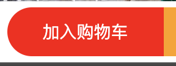
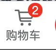
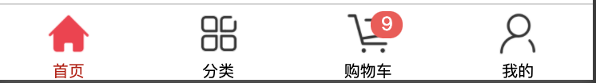

# 功能开发：加入购物车

> 创建分支名：feature_cart


## 购物车：配置Vuex

> uni-app 项目中已经默认安装了Vuex，我们只需要配置一下即可使用。


**操作步骤**

1. 在 src 目录下创建 store 目录
2. 在 store目录下创建 index.js，这是一个vuex store的主模块文件

```js
// 1. 导入 Vue 和 Vuex
import Vue from 'vue'
import Vuex from 'vuex'

// 2. 将 Vuex 安装为 Vue 的插件
Vue.use(Vuex)

// 3. 创建 Vuex 的 Store 实例
const store = new Vuex.Store({
    // 这里可以存放多个不同的 Vuex 模块
    modules: {}
})

// 4. 导出
export default store
```

3. 在 main.js 中导入 store/index.js 模块，并关联到Vue实例上

```js
// ...

// 1. 导入 vuex store 模块
import store from '@/store'

// ...

const app = new Vue({
  // 2. 将 store 模块关联到 Vue 实例上
  store
})

// ...

```


## 购物车：创建购物车专用Vuex子模块

> 按照业务的不同，可以封装独立的vuex模块，这样可以让代码更清晰。


操作：

1. 在src/store目录下，创建modules目录，然后在该目录下创建cart.js

```js
export default {
    // 开启命名空间
    namespaced: true,

    // 状态数据
    state: {
        // 购物车中的商品数组，每个商品信息对象都包含6个属性：
        // { goods_id, goods_name, goods_price, 
      	//   goods_count, goods_small_logo, goods_state }
        cartItems: [],
    },

    // mutations 方法
    mutations: {
    },

    // getters 方法
    getters: {
    }
}
```


2. 在src/store/index.js文件中，引入cart.js并设置为 vuex 子模块

```js
// ...

// 导入cart子模块
import cartStoreModule from './modules/cart'

const store = new Vuex.Store({
    modules: {
        // 挂载cart子模块. 该模块内成员的访问路径被调整为 cart，例如:
        // 该模块中的 cartItems 的访问路径现在为 cart/cartItems
        cart: cartStoreModule
    }
})

//...
```


---


## 购物车：将商品加入购物车




**操作步骤**

1. 在商品详情页面，为“加入购物车”按钮添加点击事件

```xml
<uni-goods-nav
               :fill="true"
               :options="leftOptions"
               :buttonGroup="rightOptions"
               @click="leftButtonClick"
               @buttonClick="rightButtonClick"
               />
```


2. 在点击事件中，调用购物车 vuex 模块中的 mutations方法，将当前商品数据保存/更新到store中

```js
// 右侧按钮的点击事件处理函数
rightButtonClick(e) {
  // 1. 判断是否点击了按钮：加入购物车
  if (e.content.text === "加入购物车") {
    
    // 2. 组织一个商品信息对象
    const item = {
      goods_id: this.info.goods_id, // 商品的Id
      goods_name: this.info.goods_name, // 商品的名称
      goods_price: this.info.goods_price, // 商品的价格
      goods_count: 1, // 商品的数量
      goods_small_logo: this.info.goods_small_logo, // 商品的图片
      goods_state: true, // 商品的勾选状态
    };
    
    // 3. 调用 store 中的 mutations 把商品信息对象存储到购物车中
    this.$store.commit("cart/addToCart", item);
  }
}
```

在cart.js中实现名为 addCart 的 mutations

```js
// 模块的 mutations 方法
mutations: {
  addToCart(state, item) {
    // 根据 商品id 查询购物车中是否存在这件商品
    const existedItem = state.cartItems.find(x => x.goods_id === item.goods_id)

    if (existedItem) {
      // 如果购物车中已经有这件商品，则更新数量
      existedItem.goods_count++
    } else {
      // 如果购物车中没有这件商品，则添加进去
      state.cartItems.push(item)
    }
  }
}
```


---


## 购物车：统计购物车中的商品总数




**操作步骤**

1. 在 cart.js 中的 getters 里编写一个统计购物车内商品总数的方法

```js
// 模块的 getters 方法
getters: {
  // 统计购物车中商品的总数量
  total(state) {
    let result = 0
    state.cartItems.forEach((item) => {
      result += item.goods_count
    })
    return result
  }
}
```


2. 在商品详情页面中使用这个getters方法创建一个计算属性total

```js
computed: {
  total() {
    return this.$store.getters['cart/total']
  }
}
```


3. 使用 watch 来侦听 total 计算属性，并在它变化时去更新 gnOptions 数据（因为购物车图标上显示的数字包含在 leftOptions 中）

```js
watch: {
  total(newVal) {
    this.leftOptions[1].info = newVal
  }
}
```


---


## 购物车：持久化购物车中的信息


**操作步骤**

1. 在store的addToCart方法最后去调用API将数据存储到本地缓存中

```js
addToCart(state, item) {
  // ...

  // 将购物车信息保持到本地缓存中
  uni.setStorageSync('cart', JSON.stringify(state.cartItems))
}
```


2. 改造store中初始化cartItems状态时的语句（使用了一个函数而非对象），在函数中调用API读取本地缓存进行初始化

```js
state: () => {
  // 购物车的数组，用来存储购物车中每个商品的信息对象
  // 每个商品的信息对象，都包含如下 6 个属性：
  // { goods_id, goods_name, goods_price, goods_count, goods_small_logo, goods_state }

  // 从本地缓存获取购物车信息
  const cachedCartItems = uni.getStorageSync('cart')

  return {
    // 如果缓存中有数据，转换回JSON对象数组，否则设置为空数组
    cartItems: cachedCartItems ? JSON.parse(cachedCartItems) : []
  }
}
```


---


## 购物车：优化 total 侦听器


**问题描述**

目前，购物车信息已经能保存到本地缓存，但重新进入商品详情页，底部按钮上并不能显示缓存中的商品总数。


**原因分析**

原因是 total 侦听器并不会在页面初次加载时执行，而要在后续的数据变化时才执行，因此一进页面是看不到缓存的商品总数的。


**代码优化**

优化前的 total 侦听器：

```js
total(newVal) {
  this.gnOptions[1].info = newVal
}
```

优化后的 total 侦听器：

```js
total: {
  // handler 用来定义侦听器的处理函数(handler函数名是固定的)
  handler(newVal) {
    this.gnOptions[1].info = newVal;
  },
  // immediate 属性用来声明此侦听器是否在页面初次加载完后立即调用一次
  immediate: true,
}
```


---


# 功能开发：购物车


## 购物车：购物车顶部区域

模板代码：

```xml
<!-- 购物车商品列表的标题区域 -->
<view class="cart-title">
  <!-- 左侧的图标 -->
  <uni-icons type="shop" size="18"></uni-icons>
  <!-- 描述文本 -->
  <text class="cart-title-text">购物车</text>
</view>
```

样式代码：

```scss
.cart-title {
  height: 80rpx;
  display: flex;
  align-items: center;
  font-size: 28rpx;
  padding-left: 10rpx;
  border-bottom: 1rpx solid #efefef;
  .cart-title-text {
    margin-left: 20rpx;
  }
}
```


---


## 购物车：购物车内商品列表

模板代码：

```xml
<!-- 商品列表区域 -->
<block v-for="(product, index) in cartItems" :key="index">
  <view class="goods-item">
    <!-- 商品左侧图片区域 -->
    <view class="goods-item-left">
      <radio :checked="product.goods_state" color="#C00000"></radio>
      <image
             :src="product.goods_small_logo || defaultImage"
             class="goods-pic"
             ></image>
    </view>
    <!-- 商品右侧信息区域 -->
    <view class="goods-item-right">
      <!-- 商品标题 -->
      <view class="goods-name">{{ product.goods_name }}</view>
      <view class="goods-info-box">
        <!-- 商品价格 -->
        <view class="goods-price">￥{{ product.goods_price | tofixed }}</view>
      </view>
    </view>
  </view>
</block>
```

逻辑代码：

```js
export default {
  
  filters: {
    // 把数字处理为带两位小数点的数字
    tofixed(data) {
      return Number(data).toFixed(2);
    }
  },

  computed: {
    cartItems() {
      return this.$store.state.cart.cartItems;
    }
  }
  
};
```

样式代码：

```scss
.goods-item {
  display: flex;
  padding: 20rpx 10rpx;
  border-bottom: 1rpx solid #f0f0f0;

  .goods-item-left {
    margin-right: 10rpx;
    display: flex;
    justify-content: space-between;
    align-items: center;

    .goods-pic {
      width: 200rpx;
      height: 200rpx;
      display: block;
    }
  }

  .goods-item-right {
    display: flex;
    flex-direction: column;
    justify-content: space-between;

    .goods-name {
      font-size: 26rpx;
    }

    .goods-price {
      font-size: 32rpx;
      color: #c00000;
    }
  }
}
```


---


## 购物车：处理商品的勾选状态


**操作步骤**

1. 为单选框设置点击事件

```xml
<radio
       :checked="product.goods_state"
       color="#C00000"
       @click="radioChangeHandler(product)"
       ></radio>
```


2. 在vuex cart模块中添加一个用于更新商品选中状态的mutations

```js
mutations: {
  updateState(state, item) {
    // 在 store 中查找对应的商品数据
		const existedItem = state.cartItems.find(x => x.goods_id === item.goods_id)

    if (result) {
      // 更新查找到的商品数据的选中状态
      result.goods_state = item.goods_state
      
      // 持久化到本地存储
      uni.setStorageSync('cart', JSON.stringify(state.cartItems))
    }
  }
}
```


3. 在单选框点击事件中调用mutations更新选中状态

```js
methods: {
  radioChangeHandler(item) {
    // 反选状态
    item.goods_state = !item.goods_state;
    // 更新store中的数据
    this.$store.commit("cart/updateState", item);
  }
}
```


---


## 购物车：改变商品购买数量1-界面

模板代码：

```xml
<view class="goods-info-box">
  <!-- 商品价格 -->
  <view class="goods-price">￥{{ product.goods_price | tofixed }}</view>
  <!-- 商品数量 -->
  <uni-number-box :min="1" :value="product.goods_count"></uni-number-box>
</view>
```

样式代码：

```scss
.goods-item-right {
  display: flex;
  flex: 1;
  flex-direction: column;
  justify-content: space-between;

  .goods-name {
    font-size: 26rpx;
  }

  .goods-info-box {
    display: flex;
    align-items: center;
    justify-content: space-between;
  }

  .goods-price {
    font-size: 32rpx;
    color: #c00000;
  }
}
```


---


## 购物车：改变商品购买数量2-逻辑


**操作步骤**

1. 为数量调节框添加监听事件

```xml
<!-- 商品数量 -->
<uni-number-box
                :min="1"
                :value="product.goods_count"
                @change="numberChangeHandler($event, product)"
                ></uni-number-box>
```


2. 在vuex cart模块中添加一个用于更新商品数量的mutations

```js
mutations: {
	updateCount(state, item) {
    // 在 store 中查找对应的商品数据
    const existedItem = state.cartItems.find(x => x.goods_id === item.goods_id)

    if (existedItem) {
      // 更新查找到的商品数据的数量
      existedItem.goods_count = item.goods_count
      
      // 持久化到本地存储
      uni.setStorageSync('cart', JSON.stringify(state.cartItems))
    }
  }
}
```


3. 在事件监听函数中调用mutations，更新商品数量

```js
methods: {
  numberChangeHandler(e, item) {
    // 设置最新的商品数量
    item.goods_count = parseInt(e);
    // 更新store中的数据
    this.$store.commit("cart/updateCount", item);
  }
}
```


---


## 购物车：商品滑动删除1-界面

模板代码：

```xml
<!-- 商品列表区域 -->
<!-- uni-swipe-action 是最外层包裹性质的容器 -->
<uni-swipe-action>
  
  <block v-for="(product, index) in cartItems" :key="index">
  
    <!-- 
      uni-swipe-action-item 可以为其子节点提供滑动操作的效果。
      需要通过 options 属性来指定操作按钮的配置信息 
    -->
    <uni-swipe-action-item
                           :right-options="swipeOptions"
                           @click="swipeActionClickHandler(product)"
                           >
      <view class="goods-item">
        ...
      </view>
    </uni-swipe-action-item>
  </block>
</uni-swipe-action>
```

逻辑代码：

```js
export default {
  data() {
    return {
      swipeOptions: [
        {
          text: "删除", // 显示的按钮文本
          style: {
            backgroundColor: "#C00000", // 按钮的背景颜色
          }
        }
      ]
    };
  },
  
  methods: {
    // 点击了滑动操作按钮
    swipeActionClickHandler(item) {
      console.log(item);
    }
  }
}
```

样式代码：

```scss
.goods-item {
  display: flex;
  padding: 20rpx 10rpx;
  border-bottom: 2rpx solid #f0f0f0;
  
  // 让 goods-item 项占满整个屏幕的宽度
  width: 750rpx;
  
  // 设置盒模型为 border-box
  box-sizing: border-box;

  // ....
}
```


---


## 购物车：商品滑动删除2-逻辑


**操作步骤**

1. 在vuex cart模块中实现一个按照商品id删除购物车内商品的mutations

```js
mutations: {
  removeById(state, id) {
    // 调用数组的 filter 方法进行过滤
    state.cartItems = state.cartItems.filter(x => x.goods_id !== id)
    
    // 持久化到本地存储
    uni.setStorageSync('cart', JSON.stringify(state.cartItems))
  }
}
```

2. 在滑动删除组件的点击事件监听函数中，调用mutations来进行删除商品

```js
methods: {
// 点击了滑动操作按钮
  swipeActionClickHandler(item) {
    // 根据ID删除购物车中的指定商品
    this.$store.commit("cart/removeById", item.goods_id);
  }
}
```


---


## 购物车：设置tabBar徽标

> 在页面的tabBar的购物车按钮上显示当前购物车内商品总数




**操作步骤**

1. 在 cart.vue 页面中，编写一个计算属性，它从vuex的getters获取数据

```js
computed: {
  total() {
    return this.$store.getters["cart/total"];
  },
}
```


2. 在 cart.vue 中使用 `watch` 监听 `total` 变化，并调用API设置tabBar上的徽标内容

```js
watch: {
  total: {
    handler(newVal) {
      if (newVal > 0) {
        // 大于0的时候才显示徽标
        uni.setTabBarBadge({
          index: 2, // tabBar的按钮索引，也就是第三个按钮
          text: "" + newVal, // 必须是字符串值！！！
        });
      } else {
        // 小于等于0则删除徽标
        uni.removeTabBarBadge({
          index: 2
        })
      }
    },
    immediate: true
  }
}
```


---


## 购物车：在任意页面更新tabBar徽标

问题：当前只有点击 ”购物车“ tabbar按钮时才会更新徽标数据

方案：使用 mixins 机制封装更新徽标的功能代码，然后添加到各个页面组件中


**操作步骤**

1. 新建 `src/mixins/tabbar-badge.js` 并编写如下 mixins 代码

```js
export default {
    computed: {
        total() {
            return this.$store.getters["cart/total"];
        },
    },
  
    watch: {
      total: {
        handler(newVal) {
          if (newVal > 0) {
            // 大于0的时候才显示徽标
            uni.setTabBarBadge({
              index: 2, // tabBar的按钮索引，也就是第三个按钮
              text: "" + newVal, // 必须是字符串值！！！
            });
          } else {
            // 小于等于0则删除徽标
            uni.removeTabBarBadge({
              index: 2
            })
          }
        },
        immediate: true
      }
    }
};
```


2. 在 `home.vue`、`category.vue`、`cart.vue`、`my.vue` 中引入 `tabbar-badge.js`中的 mixins

```js
import tabBarBadgeMixin from "@/mixins/tabbar-badge";

export default {
  mixins: [tabBarBadgeMixin],
};
```


---


## 购物车：创建收货地址组件


**操作步骤**

1. 在 components 目录下新建 my-address.vue 文件

模板代码：

```xml
<template>
  <view>
    <!-- 选择收货地址的盒子 -->
    <view class="address-choose-box">
      <button type="primary" size="mini" class="btnChooseAddress">
        请选择收货地址+
      </button>
    </view>

    <!-- 渲染收货信息的盒子 -->
    <view class="address-info-box">
      <view class="row1">
        <view class="row1-left">
          <view class="username">收货人：<text>escook</text></view>
        </view>
        <view class="row1-right">
          <view class="phone">电话：<text>138XXXX5555</text></view>
          <uni-icons type="arrowright" size="16"></uni-icons>
        </view>
      </view>
      <view class="row2">
        <view class="row2-left">收货地址：</view>
        <view class="row2-right"
          >河北省邯郸市肥乡区xxx 河北省邯郸市肥乡区xxx 河北省邯郸市肥乡区xxx
          河北省邯郸市肥乡区xxx
        </view>
      </view>
    </view>

    <!-- 底部的边框线 -->
    <view class="address-border"></view>
  </view>
</template>
```

样式代码：

```vue
<style scoped lang="scss">
// 底部边框线的样式
.address-border {
  display: block;
  width: 100%;
  height: 10rpx;
  border-bottom: 1rpx solid #efefef;
}

// 选择收货地址的盒子
.address-choose-box {
  height: 180rpx;
  display: flex;
  align-items: center;
  justify-content: center;
}

// 渲染收货信息的盒子
.address-info-box {
  font-size: 24rpx;
  height: 180rpx;
  display: flex;
  flex-direction: column;
  justify-content: center;
  padding: 0 10rpx;

  // 第一行
  .row1 {
    display: flex;
    justify-content: space-between;

    .row1-right {
      display: flex;
      align-items: center;

      .phone {
        margin-right: 10rpx;
      }
    }
  }

  // 第二行
  .row2 {
    display: flex;
    align-items: center;
    margin-top: 20rpx;

    .row2-left {
      white-space: nowrap;
    }
  }
}
</style>
```


2. 在 cart.vue 页面组件中引用 my-address.vue 组件

```xml
<!-- 地址信息 -->
<my-address></my-address>

<!-- 商品列表区域 -->
```

```js
import MyAddress from "@/components/my-address.vue";

export default {
  components: {
    MyAddress
  }
}
```


---


## 购物车：收货地址区域按需显示


模板代码：

```xml
<!-- 选择收货地址的盒子 -->
<view class="address-choose-box" v-if="JSON.stringify(address) === '{}'">
  ...
</view>

<!-- 渲染收货信息的盒子 -->
<view class="address-info-box" v-else>
  ...
</view>

```

逻辑代码：

```js
export default {
  data() {
    return {
      // 收货地址
      address: {},
    };
  },
};
```


---


## 购物车：收货地址选择功能


**操作步骤**

1. 为“选择收获地址+”按钮添加事件监听

```xml
<button
        type="primary"
        size="mini"
        class="btnChooseAddress"
        @click="chooseAddressHandler"
        >
  请选择收货地址+
</button>
```


2. 在监听函数中调用uni.chooseAddress() 实现对微信中存储的个人地址的选择

```js
methods: {
  
  // 选择收货地址
  async chooseAddressHandler() {
    // 1. 调用小程序提供的 chooseAddress() 方法，即可使用选择收货地址的功能
    //    返回值是一个数组：
    //        - 第 1 项为错误对象
    //        - 第 2 项为成功之后的收货地址对象
    const [err, res] = await uni.chooseAddress();

    // 2. 用户成功的选择了收货地址
    if (!err && res.errMsg === "chooseAddress:ok") {
      // 为 data 里面的收货地址对象赋值
      this.address = res;
    }
  }
  
}
```


3. 将获取的个人地址信息拼装成完整收获地址

```js
computed: {
  // 收货详细地址的计算属性
  fullAddress() {
    const { provinceName, cityName, countyName, detailInfo } = this.address;

    if (!provinceName) return "";

    // 拼接 省，市，区，详细地址 的字符串并返回给用户
    return provinceName + cityName + countyName + detailInfo;
  }
}
```


4. 在页面中展示收货信息

```xml
<!-- 渲染收货信息的盒子 -->
<view class="address-info-box" v-else>
  <view class="row1">
    <view class="row1-left">
      <view class="username">
        收货人：<text>{{ address.userName }}</text>
      </view>
    </view>
    <view class="row1-right">
      <view class="phone">
        电话：<text>{{ address.telNumber }}</text>
      </view>
      <uni-icons type="arrowright" size="16"></uni-icons>
    </view>
  </view>
  <view class="row2">
    <view class="row2-left">收货地址：</view>
    <view class="row2-right">{{ fullAddress }} </view>
  </view>
</view>
```


---


## 购物车：将收货地址存入Vuex


**操作步骤**

1. 在store/modules目录中新建一个user.js模块，用于存储用户相关信息

```js
export default {

    // 开启命名空间
    namespaced: true,

    state: () => {
        // 1. 从本地缓存获取购物车信息
        const cachedAddress = uni.getStorageSync('address')
        
        return {
            // 收货地址
            address: cachedAddress ? JSON.parse(cachedAddress) : {},
        }
    },

    mutations: {
        // 更新收货地址
        updateAddress(state, address) {
            state.address = address
          
            // 2. 持久化到本地缓存
            uni.setStorageSync('address', JSON.stringify(state.address))
        },
    },

    getters: {},

}
```


2. 在store/index.js中导入 user.js 模块

```js
// 1. 导入 Vue 和 Vuex
import Vue from 'vue'
import Vuex from 'vuex'

// 导入cart子模块
import cartStoreModule from './modules/cart'

// 导入user子模块
import userStoreModule from './modules/user'

// 2. 将 Vuex 安装为 Vue 的插件
Vue.use(Vuex)

// 3. 创建 Vuex 的 Store 实例
const store = new Vuex.Store({
    // 这里可以存放多个不同的 Vuex 模块
    modules: {
        // 挂载cart子模块. 该模块内成员的访问路径被调整为 cart，例如:
        // 该模块中的 cartItems 的访问路径现在为 cart/cartItems
        cart: cartStoreModule,

        // 挂载user子模块
        user: userStoreModule
    }
})

// 4. 导出
export default store
```


3. 改造my-address.vue组件，使用vuex模块user.js中的数据替代本组件data中定义的address

```js
export default {
  data() {
    return {
      // 1. 收货地址（废除）
      // address: {},
    };
  },

  computed: {
    // 2. 从 store 中获取 address 地址值
    address() {
      return this.$store.state.user.address;
    }
  },

  methods: {
    // 选择收货地址
    async chooseAddressHandler() {
      // ...
      
      if (!err && res.errMsg === "chooseAddress:ok") {
        // 3. 为 data 里面的收货地址对象赋值（废除）
        // this.address = res;

        // 4. 更新 vuex 中的地址值
        this.$store.commit("user/updateAddress", res);
      }
    }
  }
};
```


---


## 购物车：将 fullAddress 实现为 Vuex Getters

> 优化目的：提高代码复用性


**操作步骤**

1. 将my-address.vue组件中的fullAddress计算属性，移动到 vuex 模块 user.js 中，改造为一个getters

```js
getters: {
  fullAddress(state) {
    const { provinceName, cityName, countyName, detailInfo } = state.address;
    
    if (!provinceName) return "";
    
    // 拼接 省，市，区，详细地址 的字符串并返回给用户
    return provinceName + cityName + countyName + detailInfo;
  }
}
```


2. 在my-address.vue组件中使用新建的getters替换原来的计算属性

```js
computed: {
  // 收货详细地址的计算属性
  fullAddress() {
    return this.$store.getters['user/fullAddress']
  }
}
```


---


## 购物车：收货地址的重选功能

为类名为 `address-info-box` 的组件添加 click 事件，并调用之前的`chooseAddressHandler`方法：

```xml
<view class="address-info-box" v-else @click="chooseAddressHandler">
```


---


## 购物车：新建结算区域组件


**操作步骤**

1. 在 components 中新建 my-checkout.vue

```vue
<template>
  <!-- 最外层的容器 -->
  <view class="my-checkout-container">
    <!-- 全选区域 -->
    <label class="radio">
      <radio color="#C00000" :checked="true" />
      <text>全选</text>
    </label>

    <!-- 合计区域 -->
    <view class="amount-box"> 合计:<text class="amount">￥1234.00</text> </view>

    <!-- 结算按钮 -->
    <view class="btn-checkout">结算(0)</view>
  </view>
</template>

<script>
export default {
  data() {
    return {};
  },
};
</script>

<style lang="scss">
.my-checkout-container {
  position: fixed;
  bottom: 0;
  left: 0;
  width: 100%;
  height: 100rpx;
  background-color: white;
  display: flex;
  justify-content: space-between;
  align-items: center;
  padding-left: 10rpx;
  font-size: 28rpx;

  .radio {
    display: flex;
    align-items: center;
  }

  .amount {
    color: #c00000;
  }

  .btn-checkout {
    height: 100rpx;
    min-width: 200rpx;
    background-color: #c00000;
    color: white;
    line-height: 100rpx;
    text-align: center;
    padding: 0 20rpx;
  }
}
</style>
```

2. 在 cart.vue 中引入 my-checkout.vue

```vue
<template>
  <!-- 为根组件添加一个样式 cart-container -->
	<view class="cart-container">
		<!-- ... -->
	
   	<!-- 结算区域 -->
    <my-checkout></my-checkout>
  </view>
</template>

<script>
import MyCheckout from "@/components/my-checkout.vue";
  
export default {
  components: {
    MyCheckout,
  }
}
</script>

<style lang="scss">
.cart-container {
  padding-bottom: 100rpx;
}
</style>
```


---


## 购物车：结算按钮显示已勾选商品总数


**操作步骤**

1. 在vuex cart模块中定义一个用于统计勾选商品总数的getters

```js
getters: {
  
	// 统计购物车中已勾选商品的总数量
  checkedTotal(state) {
    let result = 0
    
    state.cartItems.forEach(item => {
      if (item.goods_state) {
        result += item.goods_count
      }
    })
    
    return result
  }
  
}
```


2. 在my-checkout组件中定义一个使用了以上getters的计算属性

```js
computed: {
  checkedTotal() {
    return this.$store.getters["cart/checkedTotal"];
  }
}
```


3. 渲染从vuex cart模块中得到的勾选商品总数

```xml
<!-- 结算按钮 -->
<view class="btn-checkout">结算({{ checkedTotal }})</view>
```


---


## 购物车：“全选”的勾选状态显示


**操作步骤**

1. 定义一个计算属性isAllChecked，通过比较 total 和 checkedTotal 两个来获取是否已全选

```js
computed: {
    checkedTotal() {
      return this.$store.getters["cart/checkedTotal"];
    },
      
    total() {
      return this.$store.getters["cart/total"]
    },
      
    isAllChecked() {
      return this.checkedTotal === this.total;
    }
}
```


2. 为“全选”单选框绑定isAllChecked计算属性

```xml
<radio color="#C00000" :checked="isAllChecked" />
```


---


## 购物车：“全选”的点击逻辑处理


**操作步骤**

1. 在vuex cart模块中定义一个用于更新全部购物车商品选中状态的mutations

```js
updateAllState(state, checked) {
  // 遍历商品，更新所有的 goods_state
  state.cartItems.forEach(x => {
  	x.goods_state = checked
  })
  
  // 持久化到本地存储
  uni.setStorageSync('cart', JSON.stringify(state.cartItems))
}
```


2. 在my-checkout组件中的全选按钮区域添加点击事件并调用以上的mutations

```xml
<!-- 全选区域 -->
<label class="radio" @click="checkAllHandler">
```

```js
methods: {
  checkAllHandler() {
    this.$store.commit("cart/updateAllState", !this.isAllChecked);
  }
}
```


---


## 购物车：计算已勾选的商品总价


**操作步骤**

1. 在vuex cart模块中定义一个用于计算勾选过的商品总价格的getters

```js
getters: {
  
	// 已勾选的商品的总价
  checkedAmount(state) {
    let result = 0
    
    state.cartItems.forEach(item => {
      if (item.goods_state) {
        result += item.goods_count * item.goods_price
      }
    })
    
    return result.toFixed(2)
  }
  
}
```


2. 在 my-checkout 组件中创建计算属性并引用上的getters

```js
computed: {
  checkedAmount() {
    return this.$store.getters["cart/checkedAmount"];
  }
}
```


3. 在界面上渲染总价信息

```xml
<!-- 合计区域 -->
<view class="amount-box">
  合计:<text class="amount">￥{{ checkedAmount }}</text>
</view>
```


---


## 购物车：购物车内没有商品时的界面


模板代码：

```vue
<template>
	<!-- 购物车有商品时 -->
  <view class="cart-container" v-if="cartItems.length > 0">
    
  </view>

	<!-- 购物车无商品时 -->
  <view class="empty-cart" v-else>
    <text class="tip-text">空空如也~</text>
  </view>
</template>
```

样式代码：

```scss
.empty-cart {
  display: flex;
  flex-direction: column;
  align-items: center;
  padding-top: 300rpx;

  .tip-text {
    font-size: 24rpx;
    color: gray;
    margin-top: 30rpx;
  }
}
```


---


# 功能开发：登录与支付

> 创建分支名：feature_checkout


## 登录与支付：点击结算按钮后的检查逻辑

> 用户点击了结算按钮后，需要作以下条件判断：
>
> 1. 是否已勾选要结算的商品
>
> 2. 是否已选择收货地址
>
> 3. 是否已登录


**操作步骤**

1. 在 my-checkout.vue 组件中，为结算按钮绑定点击事件监听函数

```xml
<!-- 结算按钮 -->
<view class="btn-checkout" @click="checkoutButtonHandler">结算({{ checkedTotal }})</view>
```


2. 在vuex user模块中，声明一个 token 状态数据

```js
state: () => {
  return {
    // 登录后的 token 字符串
    token: ''
  }
}
```


3. 在 my-checkout.vue 中引入 vuex user模块中的 fullAddress 和 token

```js
  computed: {
    // ....
    
    fullAddress() {
      return this.$store.getters["user/fullAddress"];
    },
      
    token() {
      return this.$store.state.user.token;
    }
  }
```


4. 在结算按钮点击事件监听函数中，进行一些条件的检查

```js
checkoutButtonHandler() {
  // 1. 先判断是否勾选了要结算的商品
  if (!this.checkedTotal) {
    return this.$errmsg("请选择要结算的商品！");
  }

  // 2. 再判断用户是否选择了收货地址
  if (!this.fullAddress) {
    return this.$errmsg("请选择收货地址！");
  }

  // 3. 最后判断用户是否登录了
  if (!this.token) {
    return this.$errmsg("请先登录！");
  }
  
}
```


---


## 我的：登录界面与用户信息展示


**操作步骤**

1. 在 components 目录中新建2个空组件：my-login.vue 和 my-userinfo.vue

   

2. 在 my.vue 页面中引入vuex user模块中的 token 状态信息

```js
computed: {
  token() {
    return this.$store.state.user.token;
  }
}
```


3. 在 my.vue 页面中引入 my-login 和 my-userinfo 组件, 并根据 token 有无判断是展示 my-login 还是 my-userinfo

```xml
<template>
  <view>
    <!-- 没有 token 显示登录 -->
    <my-login v-if="!token"></my-login>

    <!-- 有 token 显示用户信息 -->
    <my-userinfo v-else></my-userinfo>
  </view>
</template>
```

```js
import MyLogin from "@/components/my-login.vue";
import MyUserinfo from "@/components/my-userinfo.vue";

export default {
	components: {
    MyLogin,
    MyUserinfo,
  }
}
```


---


## 我的：登录界面

模板代码：

```xml
<template>
  <view class="login-container">
    <!-- 提示登录的图标 -->
    <uni-icons type="contact-filled" size="100" color="#AFAFAF"></uni-icons>

    <!-- 登录按钮 -->
    <button type="primary" class="btn-login">一键登录</button>
    
    <!-- 登录提示 -->
    <view class="tips-text">登录后尽享更多权益</view>
  </view>
</template>
```

样式代码：

```scss
.login-container {
  // 登录盒子的样式
  height: 750rpx;
  display: flex;
  flex-direction: column;
  align-items: center;
  justify-content: center;
  background-color: #f8f8f8;
  position: relative;
  overflow: hidden;

  // 绘制登录盒子底部的半椭圆造型
  &::after {
    content: " ";
    display: block;
    position: absolute;
    width: 100%;
    height: 80rpx;
    left: 0;
    bottom: 0;
    background-color: white;
    border-radius: 100%;
    transform: translateY(50%);
  }

  // 登录按钮的样式
  .btn-login {
    width: 90%;
    border-radius: 200rpx;
    margin: 30rpx 0;
    background-color: #c00000;
  }

  // 按钮下方提示消息的样式
  .tips-text {
    font-size: 24rpx;
    color: gray;
  }
}
```


---


## 我的：一键登录获取微信用户信息

> 获取微信用户的头像、昵称等基本信息。


**操作步骤**

1. 为登录按钮添加点击事件

```vue
<button type="primary" class="btn-login" @click="getUserInfoHandler">
  一键登录
</button>
```


2. 在点击事件监听函数中，调用改版后的API获取用户信息

```json
async getUserInfoHandler() {
  // 获取真实的用户信息
  const [err, res] = await uni.getUserProfile({
  	lang: "zh_CN",
  	desc: "获取用户基本信息",
  });

  if (err) {
  	return this.$errmsg("获取用户信息失败！");
  }

  const detail = res;

  const userInfo = detail.userInfo;
},
```


---


## 我的：将用户信息存入Vuex


**操作步骤**

1. 在vuex user模块中添加一个 userinfo 状态，并试图从缓存中读取并初始化

```js
state: () => {
  const cachedUserinfo = uni.getStorageSync('userinfo')

  return {
    // 用户信息
    userinfo: cachedUserinfo ? JSON.parse(cachedUserinfo) : {}
  }
},
```


2. 在vuex user模块中添加1个mutations，用于更新用户信息到store中

```js
mutations: {
  // 更新用户的基本信息
  updateUserInfo(state, userinfo) {
    state.userinfo = userinfo
    
    // 持久化到本地缓存
    uni.setStorageSync('userinfo', JSON.stringify(state.userinfo))
  }
}
```


3. 在 my-login 组件中调用mutations更新用户信息到vuex

```js
getUserInfoHandler() {
  // ...

  // 将用户信息更新到 Vuex
  this.$store.commit("user/updateUserInfo", userInfo);
}
```


---


## 我的：登录并获取Token

> 当获取到了微信用户的基本信息之后，还需要进一步调用登录相关的接口换取登录成功之后的 Token 字符串


**操作步骤**

1. 在登录按钮的getuserinfo事件监听函数中，预调用一个 getToken 方法

```js
getUserInfoHandler() {
  // ...

  // 获取 Token
  this.getToken(detail);
}
```


2. 实现 getToken方法，它会调用登录相关API

```js
// 调用登录接口，换取永久的 token
async getToken(detail) {
  // 1. 调用微信登录接口，获取登录码
  const [err, res] = await uni.login();

  // 2. 判断获取登陆码是否失败
  if (err || res.errMsg !== "login:ok") {
    return this.$errmsg("登录失败！");
  }

  // 3. 换取后端登陆 token
  const { meta, message } = await this.$http.post("/users/wxlogin", {
    code: res.code,
    encryptedData: detail.encryptedData,
    iv: detail.iv,
    rawData: detail.rawData,
    signature: detail.signature,
  });

  if (meta.status !== 200) {
    return this.$errmsg("登录失败！");
  }

  this.$errmsg("登录成功");

  const token = message.token
}
```


---


## 我的：将Token存入Vuex


**操作步骤**

1. 在vuex user模块中增加 mutations

```js
mutations: {
  updateToken(state, token) {
    state.token = token

    // 持久化到本地缓存
    uni.setStorageSync('token', state.token || '')
  }
}
```


2. 在vuex user模块的 state 中尝试从本地缓存加载 token

```js
state: () => {
  const cachedToken = uni.getStorageSync('token')

  return {
    // 登录后的 token 字符串
    token: cachedToken || ''
  }
}
```


3. 在 my-login组件中在换取到token后调用mutations保存token数据

```js
async getToken(info) {
  // ...
  
  // 将 token 更新到 vuex 中
  this.$store.commit("user/updateToken", token);
}
```


---


## 我的：用户信息区域


**操作步骤**

1. 在 my-userinfo.vue 组件中：

```xml
<template>
  <view class="my-userinfo-container">
    <!-- 头像昵称区域 -->
    <view class="top-box">
      <image src="" class="avatar"></image>
      <view class="nickname">xxx</view>
    </view>
  </view>
</template>
```

```scss
.my-userinfo-container {
  height: 100%;
  // 为整个组件的结构添加浅灰色的背景
  background-color: #f4f4f4;

  .top-box {
    height: 400rpx;
    background-color: #c00000;
    display: flex;
    flex-direction: column;
    align-items: center;
    justify-content: center;

    .avatar {
      display: block;
      width: 180rpx;
      height: 180rpx;
      border-radius: 90rpx;
      border: 4rpx solid white;
      box-shadow: 0 2rpx 10rpx black;
    }

    .nickname {
      color: white;
      font-weight: bold;
      font-size: 32rpx;
      margin-top: 20rpx;
    }
  }
}
```


2. 在 **my.vue** 页面中为根组件 view 添加样式 `class="my-container"` 并增加样式，让页面高度占满整屏：

```
page, .my-container {
  height: 100%;
}
```


---


## 我的：渲染用户信息


**操作步骤**

1. 在 my-userinfo.vue中引入vuex user模块中的userinfo状态并建立计算属性

```js
computed: {
  userinfo() {
    return this.$store.state.user.userinfo;
  }
}
```


2. 使用userinfo数据渲染头像和昵称

```xml
<!-- 头像昵称区域 -->
<view class="top-box">
  <image :src="userinfo.avatarUrl" class="avatar"></image>
  <view class="nickname">{{ @userinfo.nickName }}</view>
</view>
```


---


## 我的：渲染面板区域


在 my-userinfo.vue 组件中

模板代码：

```xml
<!-- 面板的列表区域 -->
<view class="panel-list">
  <!-- 第一个面板 -->
  <view class="panel">
    <!-- panel 的主体区域 -->
    <view class="panel-body">
      <!-- panel 的 item 项 -->
      <view class="panel-item">
        <text>8</text>
        <text>收藏的店铺</text>
      </view>
      <view class="panel-item">
        <text>14</text>
        <text>收藏的商品</text>
      </view>
      <view class="panel-item">
        <text>18</text>
        <text>关注的商品</text>
      </view>
      <view class="panel-item">
        <text>84</text>
        <text>足迹</text>
      </view>
    </view>
  </view>

  <!-- 第二个面板 -->
  <view class="panel">
    <!-- 面板的标题 -->
    <view class="panel-title">我的订单</view>
    <!-- 面板的主体 -->
    <view class="panel-body">
      <!-- 面板主体中的 item 项 -->
      <view class="panel-item">
        <text>待付款</text>
      </view>
      <view class="panel-item">
        <text>待收货</text>
      </view>
      <view class="panel-item">
        <text>退款/退货</text>
      </view>
      <view class="panel-item">
        <text>全部订单</text>
      </view>
    </view>
  </view>
  
  <!-- 第三个面板 -->
  <view class="panel">
    <view class="panel-list-item">
      <text>收货地址</text>
      <uni-icons type="arrowright" size="15"></uni-icons>
    </view>
    <view class="panel-list-item">
      <text>联系客服</text>
      <uni-icons type="arrowright" size="15"></uni-icons>
    </view>
    <view class="panel-list-item">
      <text>退出登录</text>
      <uni-icons type="arrowright" size="15"></uni-icons>
    </view>
  </view>
</view>
```

样式代码：

```scss
.panel-list {
  padding: 0 20rpx;
  position: relative;
  top: -20rpx;

  .panel {
    background-color: white;
    border-radius: 6rpx;
    margin-bottom: 16rpx;

    .panel-title {
      line-height: 90rpx;
      padding-left: 20rpx;
      font-size: 30rpx;
      border-bottom: 1rpx solid #f4f4f4;
    }

    .panel-list-item {
      height: 90rpx;
      display: flex;
      justify-content: space-between;
      align-items: center;
      font-size: 30rpx;
      padding: 0 20rpx;
    }
    
    .panel-body {
      display: flex;
      justify-content: space-around;

      .panel-item {
        display: flex;
        flex-direction: column;
        align-items: center;
        justify-content: space-around;
        font-size: 26rpx;
        padding: 20rpx 0;

        .icon {
          width: 70rpx;
          height: 70rpx;
        }
      }
    }
  }
}
```


---


## 我的：退出登录


**操作步骤**

1. 为退出登录按钮绑定点击事件

```xml
<view class="panel-list-item" @click="logout">
  <text>退出登录</text>
  <uni-icons type="arrowright" size="15"></uni-icons>
</view>
```

2. 在事件监听中处理登出逻辑：重置 vuex user 模块中的 token、userinfo、address信息

```js
async logout() {
  // 提示对话框
  const [err, succ] = await uni.showModal({
    title: "提示",
    content: "确认退出登录吗？",
  });

  if (succ && succ.confirm) {
    // 用户确认了退出登录的操作，清空 vuex 中的 token、userinfo 和 address
    this.$store.commit("user/updateToken", "");
    this.$store.commit("user/updateUserInfo", {});
    this.$store.commit("user/updateAddress", {});
  }
}
```


---


## 结算：倒计时3秒后跳到登录页

> 在购物车页面中点击 “结算” 按钮，如果当前用户未登录，则倒计时 3 秒后，自动跳转到登录页


操作：

1. 在 data 中声明倒计时秒数

```js
data() {
  return {
    // 倒计时的秒数
    seconds: 3,
    
    // 倒计时定时器
    timer: null
  };
}
```


2. 在结算按钮点击事件中判断：如果用户未登录，则调用一个 delayNavigate 方法做倒计时跳转

```js
checkoutButtonHandler() {
	// ...

  // 3. 最后判断用户是否登录了
  if (!this.token) {
    // 用户未登录则倒计时3秒后跳到登录页面
    return this.delayNavigate();
  }
}
```


3. 编写 delayNavigate 方法，初步实现倒计时提示功能

```js
delayNavigate() {
  // 1. 重置秒数
  this.seconds = 3;
  
  // 2. 初次展示提示消息 
	this.$errmsg('请登录后再结算！' + this.seconds + ' 秒后自动跳转到登录页')

  // 3. 创建定时器
  this.timer = setInterval(() => {
    // 3.1 递减秒数
    this.seconds--;

    // 3.2 判断秒数 <= 0 则清除定时器并跳转
    if (this.seconds <= 0) {
      clearInterval(this.timer);
      uni.switchTab({ url: "/pages/my/my" });
    } 
		// 3.3 否则继续显示倒计时信息
    else {
      this.$errmsg('请登录后再结算！' + this.seconds + ' 秒后自动跳转到登录页')
    }
  }, 1000);
}
```


---


## 结算：登录后自动回跳之前页面

> 核心实现思路：在自动跳转到登录页面成功之后，把要返回的页面的信息对象存储到 vuex 中，从而方便登录成功之后，根据返回页面的信息重新跳转回去。
>
> 
>
> 返回页面的信息对象要保存的主要包含 { openType, from } 两个属性：
>
> - openType：以哪种方式导航回之前的页面
> - from：之前页面的 url 地址


**操作步骤**

1. 在 vuex user 模块中声明一个状态 redirectInfo

```js
state: () => {
  return {
    // 重定向的信息对象，包含属性： { openType, from }
    redirectInfo: null
  }
}
```


2. 在 vuex user 模块中编写一个 mutations，用于更新 redirectInfo

```js
mutations: {
// 更新重定向的信息对象
  updateRedirectInfo(state, info) {
    state.redirectInfo = info
  }
}
```


3. 在 my-checkout.vue 组件中的 delayNavigate 方法中调用上面编写的 mutations，将当前页面信息存入 vuex

```js
// 跳转到 my 页面
uni.switchTab({
  url: "/pages/my/my",
  
  success: () => {
    // 将页面重定向跳转信息存入 vuex
    this.$store.commit("user/updateRedirectInfo", {
      openType: "switchTab",	      // 跳转的方式
      from: "/pages/cart/cart",			// 从哪个页面跳转过去的
    });
  },
});
```


4. 在 my-login.vue 组件中的 getToken 方法中，判断登录成功后返回之前的页面

```js
async getToken(info) {
	// ...
  
  // 根据 redirectInfo 信息进行跳转
  const { openType, from } = this.$store.state.user.redirectInfo || {};

  if (openType === "switchTab") {
    uni.switchTab({
      url: from,
      
      complete: () => {
        // 跳转成功之后把 vuex 中的 redirectInfo 重置为 null
        this.$store.commit("user/updateRedirectInfo", null);
      }
    });
  }
}
```


---


## 微信支付：让请求头携带 Token

> 支付相关接口需要鉴权后才能执行，因此必须为这些接口携带请求头数据


**操作步骤**

1. 改造 utils/http.js 中的请求拦截器，使在调用需要权限的API时，都携带上 Token 信息：

```js
import store from '@/store'

// 请求拦截器
http.interceptors.request.use((request) => {
  // ...

  // 判断请求的是否为有权限的 API, 是的话为请求头添加身份认证字段值
  if (request.url.indexOf('/my/') !== -1) {
    request.headers.Authorization = store.state.user.token
  }

	// ...
})
```


---


## 微信支付：支付流程介绍


1. **创建订单**
   
   - 请求创建订单接口：把**订单金额、收货地址、订单中包含的商品信息**发送到服务器
   - 服务器返回：*订单编号*
   
   
   
2. **获取支付参数**
   
   - 请求订单预支付接口：把**订单编号**发送到服务器
   - 服务器返回：*订单预支付的参数对象*（里面包含了订单支付相关的必要参数）
   
   
   
3. **发起支付**
   
   - 调用 `uni.requestPayment(xxx)` 发起微信支付，并把步骤 2 中服务器返回的数据对象作为参数传给 `uni.requestPayment()` 


---


## 微信支付：创建订单


**操作步骤**

1. 在 my-checkout.vue 中的结算按钮点击事件监听函数中，预调用一个 payOrder 方法

```js
checkoutButtonHandler() {
  // ...

  // 4. 微信支付
  this.payOrder()
}
```


2. 实现 payOrder 方法，实现创建订单

```js
// 微信支付
async payOrder() {
  // 1. 创建订单
  // 1.1 发送请求
  const { meta, message } = await this.$http.post("/my/orders/create", {
    // 开发期间不填写真实的订单价格，写死订单总价为1分钱
    order_price: 0.01,
    // 收获地址
    consignee_addr: this.fullAddress,
    // 购物车中选中的商品
    goods: this.$store.state.cart.cartItems.filter(x => x.goods_state).map(x => ({
      goods_id: x.goods_id,
      goods_number: x.goods_count,
      goods_price: x.goods_price,
    })),
  });

  if (meta.status !== 200) {
    return this.$errmsg("创建订单失败！");
  }

  // 1.2 得到 “订单编号”
  const orderNumber = message.order_number;
}
```


---


## 微信支付：获取支付参数


```js
async payOrder() {
  // ....

  // 2. 订单预支付
  // 2.1 请求获取订单的支付信息
  const { meta: meta2, message: message2 } = await this.$http.post(
    "/my/orders/req_unifiedorder",
    {
      order_number: orderNumber,
    }
  );

  // 2.2 预付订单生成失败
  if (meta2.status !== 200) {
    return this.$errmsg("预付订单生成失败！");
  }

  // 2.3 得到订单支付相关的必要参数
  const payInfo = message2.pay;
  
}
```


---


## 微信支付：发起支付

```js
async payOrder() {
  // ....

  // 3. 发起微信支付
  // 3.1 弹出微信支付界面
  const [err, succ] = await uni.requestPayment(payInfo);

  if (err) {
    return this.$errmsg("订单未支付！");
  }

  // 3.2 查询支付结果
  const { meta: meta3 } = await this.$http.post("/my/orders/chkOrder",{
    order_number: orderNumber,
  });

  if (meta.status !== 200) {
    return this.$errmsg("订单未支付！");
  }

  // 3.3 提示支付完成
  uni.showToast({
    title: "支付完成！",
    icon: "success",
  });
}
```

